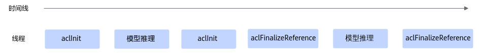
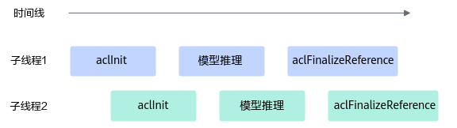

# 2. 初始化与去初始化

本章节描述 CANN Runtime 的初始化与去初始化接口，包括 ACL 环境的初始化、反初始化及相关回调注册。

- [`aclError aclInit(const char *configPath)`](#aclInit)：初始化函数。
- [`aclError aclFinalize()`](#aclFinalize)：去初始化函数，用于释放进程内acl接口使用的相关资源。
- [`aclError aclFinalizeReference(uint64_t *refCount)`](#aclFinalizeReference)：去初始化函数，用于释放进程内acl接口使用的相关资源。
- [`aclError aclInitCallbackRegister(aclRegisterCallbackType type, aclInitCallbackFunc cbFunc, void *userData)`](#aclInitCallbackRegister)：注册初始化回调函数。
- [`aclError aclInitCallbackUnRegister(aclRegisterCallbackType type, aclInitCallbackFunc cbFunc)`](#aclInitCallbackUnRegister)：若不需要触发回调函数的调用，可调用本接口取消注册回调函数。
- [`aclError aclFinalizeCallbackRegister(aclRegisterCallbackType type, aclFinalizeCallbackFunc cbFunc, void *userData)`](#aclFinalizeCallbackRegister)：注册去初始化回调函数。
- [`aclError aclFinalizeCallbackUnRegister(aclRegisterCallbackType type, aclFinalizeCallbackFunc cbFunc)`](#aclFinalizeCallbackUnRegister)：若不需要触发回调函数的调用，可调用本接口取消注册回调函数。


<a id="aclInit"></a>

## aclInit

```c
aclError aclInit(const char *configPath)
```

### 产品支持情况


| 产品 | 是否支持 |
| --- | :---: |
| Ascend 950PR/Ascend 950DT | √ |
| Atlas A3 训练系列产品/Atlas A3 推理系列产品 | √ |
| Atlas A2 训练系列产品/Atlas A2 推理系列产品 | √ |

### 功能说明

初始化函数。

使用acl接口开发应用时，必须先调用aclInit接口，否则可能会导致后续系统内部资源初始化出错，进而导致其它业务异常。

### 参数说明


| 参数名 | 输入/输出 | 说明 |
| --- | :---: | --- |
| configPath | 输入 | 配置文件所在路径（包含文件名）的指针。配置文件内容为json格式（json文件内的“{”的层级最多为10，“[”的层级最多为10）。<br>初始化时，可通过该配置文件配置开启Dump、配置Profiling采集信息等功能，详细描述请参见下文各功能配置示例中的描述。如果默认配置已满足需求，无需修改，可向aclInit接口中传入NULL，或者可将配置文件配置为空json串（即配置文件中只有{}）。 |

### 返回值说明

返回0表示成功，返回其他值表示失败，请参见[aclError](25_数据类型及其操作接口.md#aclError)。

### 约束说明

-   一个进程内支持多次调用aclInit接口初始化，但需调用aclFinalize或aclFinalizeReference接口去初始化，支持以下场景：
    -   每次调用aclInit接口时，配置必须保持一致，否则仅首次调用的配置有效，后续调用aclInit接口可能会导致报错或配置无效。
    -   为兼容旧版本，重复调用aclInit接口会返回ACL\_ERROR\_REPEAT\_INITIALIZE错误码，您可以忽略该错误继续处理业务。
    -   若调用aclInit、aclFinalize接口分别实现初始化、去初始化，支持重复初始化、去初始化，时序上仅支持顺序调用，接口调用时序如下：

        ```
        aclInit-->业务处理-->aclFinalize-->aclInit-->业务处理-->aclFinalize
        ```

        该场景下，如果调用多次aclInit接口后，再去初始化，仅需调用一次aclFinalize接口，将aclInit接口的引用计数直接清零。

    -   若调用aclInit、aclFinalizeReference接口分别实现初始化、去初始化，则需成对调用aclInit、aclFinalizeReference接口。

        因为aclFinalizeReference接口内部涉及引用计数的实现，aclInit接口每被调用一次，则引用计数加一，aclFinalizeReference接口每被调用一次，则该引用计数减一，当引用计数减到0时，才会真正去初始化。

        支持重复初始化、去初始化，时序上支持顺序调用，也支持并发调用，接口调用时序如下：

        -   顺序调用时序图如下：

            

        -   并发调用时序图如下：

            

### 模型Dump配置、单算子Dump配置

**模型Dump配置**（用于导出模型中每一层算子输入和输出数据）、**单算子Dump配置**（用于导出单个算子的输入和输出数据），导出的数据用于与指定模型或算子进行比对，定位精度问题，具体比对方法请参见[《精度调试工具用户指南》](https://hiascend.com/document/redirect/CannCommunityToolAccucacy)。**默认不启用该Dump配置。**

通过本接口启用Dump配置，需通过dump\_path参数配置保存Dump数据的路径。

模型Dump配置示例如下：

```
{                                                                                            
	"dump":{
		"dump_list":[                                                                        
			{	"model_name":"ResNet-101"
			},
			{                                                                                
				"model_name":"ResNet-50",
				"layer":[
				      "conv1conv1_relu",
				      "res2a_branch2ares2a_branch2a_relu",
				      "res2a_branch1",
				      "pool1"
				] 
			}  
		],  
		"dump_path":"/home/output",
                "dump_mode":"output",
		"dump_op_switch":"off",
                "dump_data":"tensor"
	}                                                                                        
}
```

单算子调用场景下，Dump配置示例如下：

```
{
    "dump":{
        "dump_path":"/home/output",
        "dump_list":[{}], 
	"dump_op_switch":"on",
        "dump_data":"tensor"
    }
}
```

**表 1**  acl.json文件格式说明


| 配置项 | 参数说明 |
| --- | --- |
| dump_list | （必选）待dump数据的整网模型列表。<br><br>  - 模型推理场景下，当需要Dump全部算子时，配置为："dump_list":[{}]<br>当需要Dump多个模型或特定算子时，需要结合model_name和layer使用。<br>  - 在单算子调用场景（包括单算子模型执行和单算子API执行）下，dump_list建议配置为："dump_list":[{}] |
| model_name | 模型名称，各个模型的model_name值须唯一。<br><br>  - 模型加载方式为文件加载时，填入模型文件的名称，不需要带后缀名；也可以配置为ATC模型文件转换后的json文件里的最外层"name"字段对应值。<br>  - 模型加载方式为内存加载时，配置为ATC模型文件转换后的json文件里的最外层"name"字段对应值。 |
| layer | IO性能较差时，可能会因为数据量过大而导致执行超时，因此不建议进行全量dump，请指定算子进行dump。通过该字段可以指定需要dump的算子名，支持指定为ATC模型转换后的算子名，也支持指定为转换前的原始算子名，配置时需注意：<br><br>  - 需按格式配置，每行配置模型中的一个算子名，且每个算子之间用英文逗号隔开。<br>  - 用户可以无需设置model_name，此时会默认dump所有model下的相应算子。如果配置了model_name，则dump对应model下的相应算子。<br>  - 若指定的算子其输入涉及data算子，会同时将data算子信息dump出来；若需dump data算子，需要一并填写data节点算子的后继节点，才能dump出data节点算子数据。<br>  - 当需要dump模型中所有算子时，不需要包含layer字段。 |
| optype_blacklist | 配置dump数据黑名单，黑名单中的指定类型的算子的输入或输出数据不会进行数据dump，用户可通过该配置控制dump的数据量。<br>该功能仅在执行模型数据dump操作，且dump_level为op时生效，同时支持和opname_blacklist配合使用。<br>配置示例：<br>{<br>	"dump":{<br>		"dump_list":[   <br>			{   <br>				"model_name":"ResNet-50",<br>				"optype_blacklist":[<br>				  {<br>					  "name":"conv"<br>					  "pos":["input0", "input1"]<br>					} <br>				] <br>			}<br>		],  <br>		"dump_path":"/home/output",<br>   "dump_mode":"input",<br>	}  <br>}<br>以上示例表示：不对conv算子的input0数据和input1数据执行dump操作，conv为算子类型。<br>optype_blacklist中包括name和pos字段，配置时需注意：<br><br>  - name表示算子类型，支持指定为ATC模型转换后的算子类型，配置为空时该过滤项不生效。<br>  - pos表示算子的输入或输出，仅支持配置为inputn或outputn格式，其中n表示输入输出索引号。配置为空时该过滤项不生效。<br>  - optype_blacklist内最多支持配置100个过滤项。<br>  - 如果配置了model_name，则仅对该model下的算子生效。如果不配置model_name，则对所有model下的算子生效。 |
| opname_blacklist | 配置dump数据黑名单，黑名单中的指定名称的算子的输入或输出数据不会进行数据dump，用户可通过该配置控制dump的数据量。<br>该功能仅在执行模型数据dump操作，且dump_level为op时生效，同时支持和optype_blacklist配合使用。<br>配置示例：<br>{<br>	"dump":{<br>		"dump_list":[   <br>			{   <br>				"model_name":"ResNet-50",<br>				"opname_blacklist":[<br>				  {<br>					  "name":"conv"<br>					  "pos":["input0", "input1"]<br>					} <br>				] <br>			}<br>		],  <br>		"dump_path":"/home/output",<br>   "dump_mode":"input",<br>	}  <br>}<br>以上示例表示：不对conv算子的input0数据和input1数据执行dump操作，conv为算子名称。<br>opname_blacklist中包括name和pos字段，配置时需注意：<br><br>  - name表示算子名称，支持指定为ATC模型转换后的算子名称，配置为空时该过滤项不生效。<br>  - pos表示算子的输入或输出，仅支持配置为inputn或outputn格式，其中n表示输入输出索引号。配置为空时该过滤项不生效。<br>  - opname_blacklist内最多支持配置100个过滤项。<br>  - 如果配置了model_name，则仅对该model下的算子生效。如果不配置model_name，则对所有model下的算子生效。 |
| opname_range | 配置dump数据范围，对begin到end闭区间内的数据执行dump操作。<br>该功能仅在执行模型数据dump操作，且dump_level为op时生效。<br>配置示例：<br>{<br>	"dump":{<br>		"dump_list":[<br>			{<br>				"model_name":"ResNet-50",<br>				"opname_range":[{"begin":"conv1", "end":"relu1" }, {"begin":"conv2", "end":"pool1"}]<br>			}<br>		],<br>		"dump_mode":"output",<br>   "dump_level": "op",<br>   "dump_path":"/home/output"<br>	}<br>}<br>以上示例表示对conv1到relu1、conv2到pool1闭区间内的数据执行dump操作，conv1、relu1、conv2、pool1表示算子名称。<br>配置时需注意：<br><br>  - model_name不允许为空。<br>  - begin和end中的参数表示算子名称，支持指定为ATC模型转换后的算子名称。<br>  - begin和end不允许为空，且只能配置为非data算子；若begin和end范围内算子的输入涉及data算子，会同时对data算子信息执行dump操作。 |
| dump_path | （必选）dump数据文件存储到运行环境的目录，该目录需要提前创建且确保安装时配置的运行用户具有读写权限。<br>支持配置绝对路径或相对路径：<br>  - 绝对路径配置以“/”开头，例如：/home/output。<br>  - 相对路径配置直接以目录名开始，例如：output。 |
| dump_mode | dump数据模式。<br><br>  - input：dump算子的输入数据。<br>  - output：dump算子的输出数据，默认取值output。<br>  - all：dump算子的输入、输出数据。注意，配置为all时，由于部分算子在执行过程中会修改输入数据，例如集合通信类算子HcomAllGather、HcomAllReduce等，因此系统在进行dump时，会在算子执行前dump算子输入，在算子执行后dump算子输出，这样，针对同一个算子，算子输入、输出的dump数据是分开落盘，会出现多个dump文件，在解析dump文件后，用户可通过文件内容判断是输入还是输出。 |
| dump_level | dump数据级别，取值：<br><br>  - op：按算子级别dump数据。<br>  - kernel：按kernel级别dump数据。<br>  - all：默认值，op和kernel级别的数据都dump。<br><br>默认配置下，dump数据文件会比较多，例如有一些aclnn开头的dump文件，若用户对dump性能有要求或内存资源有限时，则可以将该参数设置为op级别，以便提升dump性能、精简dump数据文件数量。<br>说明：算子是一个运算逻辑的表示（如加减乘除运算），kernel是运算逻辑真正进行计算处理的实现，需要分配具体的计算设备完成计算。 |
| dump_op_switch | 单算子调用场景（包括单算子模型执行和单算子API执行）下，是否开启dump数据采集。<br><br>  - on：开启。<br>  - off：关闭，默认取值off。 |
| dump_step | 指定采集哪些迭代的dump数据。推理场景无需配置。<br>不配置该参数，默认所有迭代都会产生dump数据，数据量比较大，建议按需指定迭代。<br>多个迭代用“|”分割，例如：0|5|10；也可以用“-”指定迭代范围，例如：0|3-5|10。<br>配置示例：<br>{<br>	"dump":{<br>		"dump_list":[   <br>			...... <br>		],  <br>		"dump_path":"/home/output",<br>   "dump_mode":"output",<br>		"dump_op_switch":"off",<br>   "dump_step": "0|3-5|10"<br>	}  <br>}<br>训练场景下，若通过acl.json中的dump_step参数指定采集哪些迭代的dump数据，又同时在GEInitialize接口中配置了ge.exec.dumpStep参数（该参数也用于指定采集哪些迭代的dump数据），则以最后配置的参数为准。GEInitialize接口的详细介绍请参见《图开发指南》。 |
| dump_data | 算子dump内容类型，取值：<br><br>  - tensor: dump算子数据，默认为tensor。<br>  - stats: dump算子统计数据，结果文件为csv格式，文件中包含算子名称、输入/输出的数据类型、最大值、最小值等。<br><br>通常dump数据量太大并且耗时长，可以先对算子统计数据进行dump，根据统计数据识别可能异常的算子，然后再dump算子数据。 |
| dump_stats | 当dump_data=stats时，可通过本参数设置收集统计数据中的哪一类数据。<br>仅Atlas A2 训练系列产品/Atlas A2 推理系列产品支持该参数。<br>本参数取值如下（若不指定取值，默认采集Max、Min、Avg、Nan、Negative Inf、Positive Inf数据）：<br><br>  - Max：dump算子统计数据中的最大值。<br>  - Min：dump算子统计数据中的最小值。<br>  - Avg：dump算子统计数据中的平均值。<br>  - Nan：dump算子统计数据中未定义或不可表示的数值，仅针对浮点类型half、bfloat、float。<br>  - Negative Inf：dump算子统计数据中的负无穷值，仅针对浮点类型half、bfloat、float。<br>  - Positive Inf：dump算子统计数据中的正无穷值，仅针对浮点类型half、bfloat、float。<br>  - L2norm：dump算子统计数据的L2Norm值。<br><br>配置示例：<br>{<br>   "dump":{<br>	"dump_list":[   <br>		...... <br>	],  <br>   "dump_path":"/home/output",<br>   "dump_mode":"output",<br>   "dump_data":"stats",<br>   "dump_stats":["Max", "Min"]<br>   }<br>} |

### 异常算子Dump配置

**异常算子Dump配置**，用于导出异常算子的输入输出数据、workspace信息、Tiling信息等。导出的数据用于分析AI Core Error问题，**默认不启用该Dump配置。**关于AI Core Error问题的信息收集及定义，详细说明请参见[《故障处理》](https://hiascend.com/document/redirect/CannCommunitytrouble)。

通过配置dump\_scene参数值开启异常算子Dump功能，配置文件中的示例内容如下，表示开启轻量化的exception dump：

```
{
    "dump":{
        "dump_path":"output",
        "dump_scene":"aic_err_brief_dump"
    }
}
```

详细配置说明及约束如下：

-   dump\_scene参数支持如下取值：
    -   aic\_err\_brief\_dump：表示轻量化exception dump，用于导出AI Core错误算子的输入&输出、workspace数据。
    -   aic\_err\_norm\_dump：表示普通exception dump，在轻量化exception dump基础上，还会导出Shape、Data Type、Format以及属性信息。
    -   aic\_err\_detail\_dump：在轻量化exception dump基础上，还会导出AI Core的内部存储、寄存器以及调用栈信息。

        配置该选项时，有以下注意事项：

        -   该选项仅支持以下型号，且需配套25.0.RC1或更高版本的驱动才可以使用：

            Atlas A3 训练系列产品/Atlas A3 推理系列产品

            Atlas A2 训练系列产品/Atlas A2 推理系列产品

            您可以单击[Link](https://www.hiascend.com/hardware/firmware-drivers/commercial)，在“固件与驱动”页面下载Ascend HDK  25.0.RC1或更高版本的驱动安装包，并参考相应版本的文档进行安装、升级。

        -   导出dump文件过程中，会暂停问题算子所在的AI Core，因此可能会影响Device上其它业务进程的正常执行，导出dump文件后，AI Core会自动恢复。因此，多个Host侧用户业务进程指定同一个Device的场景下，不建议使用aic\_err\_detail\_dump选项。
        -   导出dump文件后，会强制退出Host侧用户业务进程，强制退出过程中的报错可不作为AI Core问题分析的输入。
        -   配置aic\_err\_detail\_dump选项后，如果生成了dump文件，但不是\*.core文件，则表示aic\_err\_detail\_dump对应的功能没有使能成功，系统自动切换为按aic\_err\_brief\_dump选项dump。

    -   lite\_exception：表示轻量化exception dump，为了兼容旧版本，效果等同于aic\_err\_brief\_dump。

-   dump\_path是可选参数，表示导出dump文件的存储路径。

    dump文件存储路径的优先级如下：NPU\_COLLECT\_PATH环境变量 \> ASCEND\_WORK\_PATH环境变量 \> 配置文件中的dump\_path \> 应用程序的当前执行目录，环境变量的详细描述请参见[《环境变量参考》](https://hiascend.com/document/redirect/CannCommunityEnvRef)。

-   若需查看导出的dump文件内容，先将dump文件转换为numpy格式文件后，再通过Python查看numpy格式文件，详细转换步骤请参见[《精度调试工具用户指南》](https://hiascend.com/document/redirect/CannCommunityToolAccucacy)。

    若将dump\_scene参数设置为aic\_err\_detail\_dump时，需使用msDebug工具查看导出的dump文件内容，详细方法请参见[《算子开发工具用户指南》](https://hiascend.com/document/redirect/CannCommunityopdev)。

-   异常算子Dump配置，不能与模型Dump配置或单算子Dump配置同时开启。

### 溢出算子Dump配置

**溢出算子Dump配置**，用于导出模型中溢出算子的输入和输出数据。导出的数据用于分析溢出原因，定位模型精度的问题。**默认不启用该Dump配置。**

将dump\_debug参数设置为on表示开启溢出算子配置，配置文件中的示例内容如下：

```
{
    "dump":{
        "dump_path":"output",
        "dump_debug":"on"
    }
}
```

详细配置说明及约束如下：

-   不配置dump\_debug或将dump\_debug配置为off表示不开启溢出算子配置。
-   若开启溢出算子配置，则dump\_path必须配置，表示导出dump文件的存储路径。

    获取导出的数据文件后，文件的解析请参见[《精度调试工具用户指南》](https://hiascend.com/document/redirect/CannCommunityToolAccucacy)。

    dump\_path支持配置绝对路径或相对路径：

    -   绝对路径配置以“/“开头，例如：/home。
    -   相对路径配置直接以目录名开始，例如：output。

-   溢出算子Dump配置，不能与模型Dump配置或单算子Dump配置同时开启，否则会返回报错。
-   仅支持采集AI Core算子的溢出数据。

### 算子Dump Watch模式配置

**算子Dump Watch模式配置**，用于开启指定算子输出数据的观察模式。在定位部分算子精度问题且已排除算子本身的计算问题后，若怀疑被其它算子踩踏内存导致精度问题，可开启Dump Watch模式。**默认不开启Dump Watch模式。**

将dump\_scene参数设置为watcher，开启算子Dump Watch模式，配置文件中的示例内容如下，配置效果为：（1）当执行完A算子、B算子时，会把C算子和D算子的输出Dump出来；（2）当执行完C算子、D算子时，也会把C算子和D算子的输出Dump出来。将（1）、（2）中的C算子、D算子的Dump文件进行比较，用于排查A算子、B算子是否会踩踏C算子、D算子的输出内存。

```
{
    "dump":{
        "dump_list":[
            {
                "layer":["A", "B"],
                "watcher_nodes":["C", "D"]
            }
        ],
        "dump_path":"/home/",
        "dump_mode":"output",
        "dump_level":"op",
        "dump_scene":"watcher"
    }
}
```

详细配置说明及约束如下：

- 若开启算子Dump Watch模式，则不支持同时开启溢出算子Dump（配置dump\_debug参数）或开启单算子模型Dump（配置dump\_op\_switch参数），否则报错。该模式在单算子API Dump场景下不生效。

-   在dump\_list中，通过layer参数配置可能踩踏其它算子内存的算子名称，通过watcher\_nodes参数配置可能被其它算子踩踏输出内存导致精度有问题的算子名称。
    -   若不指定layer，则模型内所有支持Dump的算子在执行后，都会将watcher\_nodes中配置的算子的输出Dump出来。
    -   layer和watcher\_nodes处配置的算子都必须是静态图、静态子图中的算子，否则不生效。
    -   若layer和watcher\_nodes处配置的算子名称相同，或者layer处配置的是集合通信类算子（算子类型以Hcom开头，例如HcomAllReduce），则只导出watcher\_nodes中所配置算子的dump文件。
    -   对于融合算子，watcher\_nodes处配置的算子名称必须是融合后的算子名称，若配置融合前的算子名称，则不导出dump文件。
    -   dump\_list内暂不支持配置model\_name。

-   开启算子Dump Watch模式，则dump\_path必须配置，表示导出dump文件的存储路径。

    此处收集的dump文件无法通过文本工具直接查看其内容，若需查看dump文件内容，先将dump文件转换为numpy格式文件后，再通过Python查看numpy格式文件，详细转换步骤请参见[《精度调试工具用户指南》](https://hiascend.com/document/redirect/CannCommunityToolAccucacy)。

    dump\_path支持配置绝对路径或相对路径：

    -   绝对路径配置以“/“开头，例如：/home。
    -   相对路径配置直接以目录名开始，例如：output。

- 通过dump\_mode参数控制导出watcher\_nodes中所配置算子的哪部分数据，当前仅支持配置为output。

- 通过dump_level设置dump数据级别，取值如下。默认配置下，dump数据文件会比较多，例如有一些aclnn开头的dump文件，若用户对dump性能有要求或内存资源有限时，则可以将该参数设置为op级别，以便提升dump性能、精简dump数据文件数量。

    -   op：按算子级别dump数据。算子是一个运算逻辑的表示（如加减乘除运算）。
    -   kernel：按kernel级别dump数据。
    -   all：默认值，op和kernel级别的数据都dump。kernel是运算逻辑真正进行计算处理的实现，需要分配具体的计算设备完成计算。

### 算子Kernel调测信息Dump配置

**算子Kernel调测信息Dump配置**，用于导出Ascend C算子Kernel的调测信息，便于定位算子问题。**默认不启用该Dump配置。**

仅如下型号支持该配置：

Ascend 950PR/Ascend 950DT

Atlas A3 训练系列产品/Atlas A3 推理系列产品

Atlas A2 训练系列产品/Atlas A2 推理系列产品

配置dump\_kernel\_data参数开启算子Kernel调测信息Dump功能，配置文件中的示例如下：

```
{
    "dump":{
        "dump_kernel_data":"printf,assert",
        "dump_path":"/home/"
    }
}
```

详细配置说明及约束如下：

-   dump\_kernel\_data：指定导出数据的类型，支持配置多个类型，用英文逗号隔开。如果未配置该字段，但启用了模型Dump配置、单算子Dump配置，则默认按all导出调测信息。

    当前支持如下类型：

    -   all：导出以下所有类型调测的输出数据。
    -   printf：导出通过AscendC::printf调测的输出数据。
    -   tensor：导出通过AscendC::DumpTensor调测的输出数据。
    -   assert：导出通过assert/ascendc\_assert调测的输出数据。
    -   timestamp：导出通过AscendC::PrintTimeStamp调测的输出数据。

-   dump\_path：启用算子Kernel调测信息Dump功能时，dump\_path必须配置，表示导出Dump文件的存储路径，支持配置绝对路径或相对路径。

    Dump文件存储路径的优先级如下：ASCEND\_DUMP\_PATH环境变量 \> ASCEND\_WORK\_PATH环境变量 \> 配置文件中的dump\_path，环境变量的详细描述请参见[《环境变量参考》](https://hiascend.com/document/redirect/CannCommunityEnvRef)。

    导出的Dump文件无法通过文本工具直接查看其内容，若需查看，需使用show\_kernel\_debug\_data工具将调测信息解析为可读格式，工具使用指导请参见[《Ascend C算子开发指南》](https://hiascend.com/document/redirect/CannCommunityOpdevAscendC)。

### Profiling采集信息配置

**Profiling采集信息配置**，配置示例、说明及约束请参见[《性能调优工具用户指南》](https://hiascend.com/document/redirect/CannCommunityToolProfiling)。**默认不启用Profiling采集信息配置。**

建议不要同时配置Dump信息和Profiling采集信息，否则Dump操作会影响系统性能，导致Profiling采集的性能数据指标不准确。

### 算子缓存信息老化配置

**算子缓存信息老化配置**，通过单算子模型方式执行单个算子时（aclopUpdateParams接口执行单算子除外），为节约内存和平衡调用性能，可通过max\_opqueue\_num参数配置“算子类型-单算子模型”映射队列的最大长度，如果长度达到最大，则会先删除长期未使用的映射信息以及缓存中的单算子模型，再加载最新的映射信息以及对应的单算子模型。如果不配置映射队列的最大长度，则**默认最大长度为20000**。

单算子模型执行是指基于图IR执行算子，先编译算子（例如，使用ATC工具将Ascend IR定义的单算子描述文件编译成算子om模型文件），再调用acl接口加载算子模型（例如aclopSetModelDir接口），最后调用acl接口执行算子（例如aclopExecuteV2接口）。

通过max\_opqueue\_num参数配置“算子类型-单算子模型”映射队列的最大长度，实现算子缓存信息老化，配置文件中的示例内容如下：

```
{
        "max_opqueue_num": "10000"
}
```

相关配置说明及约束如下：

-   对于静态加载的算子（是指加载单算子编译成的\*.om文件，例如aclopSetModelDir接口），老化配置无效，不会对该部分的算子信息做老化。
-   对于在线编译的算子（是指调用acl接口直接编译算子，例如aclopCompile、aclopCompileAndExecuteV2等），接口内部会按照入参加载单算子模型，老化配置有效。

    如果用户调用aclopCompile接口编译算子、调用aclopExecuteV2接口执行算子，则在编译算子后需及时执行算子，否则可能导致执行算子时，算子信息已被老化，需要重新编译。建议调用aclopCompileAndExecuteV2接口编译执行算子。

-   接口内部分开维护固定Shape和动态Shape算子的映射队列，最大长度都为max\_opqueue\_num参数值。
-   max\_opqueue\_num参数值为静态加载算子的单算子模型个数和在线编译算子的单算子模型个数的总和，因此max\_opqueue\_num参数值应大于当前进程中可用的、静态加载算子的单算子模型个数，否则会导致在线编译算子的信息无法老化。

### 错误信息上报模式配置

**错误信息上报模式配置，**用于控制[aclGetRecentErrMsg](13_异常处理.md#aclGetRecentErrMsg)接口按进程或线程级别获取错误信息，**默认按线程级别**。

err\_msg\_mode参数取值范围：0为默认值，表示按线程级别获取错误信息；1表示按进程级别获取错误信息。

配置文件中的示例内容如下：

```
{
        "err_msg_mode": "1"
}
```

### 默认Device配置示例

**默认Device配置**（用于配置默认的计算设备）。若同时通过[aclrtSetDevice](04_Device管理.md#aclrtSetDevice)接口指定Device，则aclrtSetDevice接口优先级高。如果用户开启默认Device功能后，若需要显式创建Context，则需要调用[aclrtSetDevice](04_Device管理.md#aclrtSetDevice)，否则可能会导致业务异常。

default\_device参数处设置Device ID，Device ID可设置为0或十进制正整数，用户可调用[aclrtGetDeviceCount](04_Device管理.md#aclrtGetDeviceCount)接口获取可用的Device数量后，这个Device ID的取值范围：\[0, \(可用的Device数量-1\)\]。

配置文件中的示例内容如下：

```
{
    "defaultDevice":{
        "default_device":"0"
    }
}
```

### AI Core栈空间大小配置示例

**AI Core栈空间大小配置**，用于控制进程中Kernel执行时为每个AI Core分配的栈空间大小，**默认为32K字节**。在编译AI Core算子时，只有打开O0开关，此处配置的AI Core栈空间大小才有效，Ascend 950PR/Ascend 950DT上不存在该限制。

仅如下型号支持该配置：

Ascend 950PR/Ascend 950DT

Atlas A3 训练系列产品/Atlas A3 推理系列产品

Atlas A2 训练系列产品/Atlas A2 推理系列产品

aicore\_stack\_size参数处设置栈空间大小，单位Byte，取值有以下要求：

-   aicore\_stack\_size是16K的整数倍，若传入aicore\_stack\_size不是16K的整数倍，则会向上取整，确保其为16K的整数倍。
-   aicore\_stack\_size最小值为32K，若传入的aicore\_stack\_size小于32K，则按默认配置32K处理。
-   各产品的aicore\_stack\_size最大值如下：

    在Ascend 950PR/Ascend 950DT上，aicore\_stack\_size最大值为128K。

    在Atlas A3 训练系列产品/Atlas A3 推理系列产品上，aicore\_stack\_size最大值为192K。

    在Atlas A2 训练系列产品/Atlas A2 推理系列产品上，aicore\_stack\_size最大值为192K。

配置文件中的示例内容如下：

```
{
    "StackSize":{
        "aicore_stack_size":32768
    }
}
```

### SIMT算子栈空间大小配置示例

**SIMT（Single Instruction Multiple Thread）栈空间大小配置**，用于控制每个线程中SIMT算子的栈空间大小以及SIMT算子的分支（Divergence）栈空间大小，单位Byte。仅Ascend 950PR/Ascend 950DT支持该配置。

simt\_stack\_size参数处设置SIMT算子每个线程的栈空间大小，单位Byte。

simt\_divergence\_stack\_size参数处设置SIMT算子的分支（Divergence）栈空间大小，单位Byte。

simt\_stack\_size和simt\_divergence\_stack\_size的取值都必须是128的整数倍，如果传入的不是128的整数倍，则接口内部会自动向上取整，确保其为128的整数倍。

配置文件中的示例内容如下：

```
{
  "StackSize": {      
    "simt_stack_size": 1024,            
    "simt_divergence_stack_size": 512   
  }
}
```

### SIMT Printf维测空间大小配置示例

SIMT（Single Instruction Multiple Thread）Printf维测空间大小配置，用于控制SIMT算子可以Printf打印的空间大小，单位Byte。仅Ascend 950PR/Ascend 950DT支持该配置。

simt\_printf\_fifo\_size参数处设置SIMT算子Printf维测空间大小，单位Byte。其取值都必须是8的整数倍，如果传入的不是8的整数倍，则接口内部会自动向上取整，确保其为8的整数倍。

simt\_printf\_fifo\_size配置默认值2MB，最小值是1MB，最大值64MB。

配置文件中的示例内容如下：

```
{
  "simt_printf_fifo_size": 1048576
}
```

### SIMD Printf维测空间大小配置示例

SIMD（Single Instruction Multiple Data）Printf维测空间大小配置，用于控制每个Core上SIMD算子可以Printf打印的空间大小，单位Byte。仅如下型号支持该配置：

Ascend 950PR/Ascend 950DT

Atlas A3 训练系列产品/Atlas A3 推理系列产品

Atlas A2 训练系列产品/Atlas A2 推理系列产品

simd\_printf\_fifo\_size\_per\_core参数处设置SIMD算子Printf维测空间大小，单位Byte。其取值都必须是8的整数倍，如果传入的不是8的整数倍，则接口内部会自动向上取整，确保其为8的整数倍。

simd\_printf\_fifo\_size\_per\_core配置默认值32KB，最小值是1KB，最大值64MB。

配置文件中的示例内容如下：

```
{
  "simd_printf_fifo_size_per_core": 1048576
}
```

### Event资源调度模式配置示例

Event资源调度模式配置，用于在捕获方式构建模型运行实例场景下控制Event资源的调度方式。仅如下型号支持该配置：

Ascend 950PR/Ascend 950DT

Atlas A3 训练系列产品/Atlas A3 推理系列产品

Atlas A2 训练系列产品/Atlas A2 推理系列产品

event\_mode参数取值范围：0为默认值，表示内存模式，即Event资源数量受内存限制；1表示硬件加速模式，即Event资源数量受硬件规格限制，但性能更优。

配置文件中的示例内容如下：

```
{
    "acl_graph":{
        "event_mode":"0"
    }
}
```


<br>
<br>
<br>


<a id="aclFinalize"></a>

## aclFinalize

```c
aclError aclFinalize()
```

### 产品支持情况


| 产品 | 是否支持 |
| --- | :---: |
| Ascend 950PR/Ascend 950DT | √ |
| Atlas A3 训练系列产品/Atlas A3 推理系列产品 | √ |
| Atlas A2 训练系列产品/Atlas A2 推理系列产品 | √ |

### 功能说明

去初始化函数，用于释放进程内acl接口使用的相关资源。

对于涉及Device业务日志回传到Host的场景，本接口默认增加2000ms延时（实际最大延时可达2000ms），以确保ERROR级别和EVENT级别日志完整回传，防止不丢失。您可以将ASCEND\_LOG\_DEVICE\_FLUSH\_TIMEOUT环境变量设置为0（命令示例：export ASCEND\_LOG\_DEVICE\_FLUSH\_TIMEOUT=0），来取消该默认延时。关于ASCEND\_LOG\_DEVICE\_FLUSH\_TIMEOUT环境变量的详细描述请参见[《环境变量参考》](https://hiascend.com/document/redirect/CannCommunityEnvRef)中的。

### 参数说明

无

### 返回值说明

返回0表示成功，返回其他值表示失败，请参见[aclError](25_数据类型及其操作接口.md#aclError)。

### 约束说明

应用进程退出前，应确保已调用aclFinalize或[aclFinalizeReference](#aclFinalizeReference)接口完成去初始化，否则可能会导致异常，例如应用进程退出时有异常报错。

不建议在析构函数中调用aclFinalize或[aclFinalizeReference](#aclFinalizeReference)接口，否则在进程退出时可能由于单例析构顺序未知而导致进程异常退出的问题。


<br>
<br>
<br>


<a id="aclFinalizeReference"></a>

## aclFinalizeReference

```c
aclError aclFinalizeReference(uint64_t *refCount)
```

### 产品支持情况


| 产品 | 是否支持 |
| --- | :---: |
| Ascend 950PR/Ascend 950DT | √ |
| Atlas A3 训练系列产品/Atlas A3 推理系列产品 | √ |
| Atlas A2 训练系列产品/Atlas A2 推理系列产品 | √ |

### 功能说明

去初始化函数，用于释放进程内acl接口使用的相关资源。

aclFinalizeReference接口内部涉及引用计数的实现，aclInit接口每被调用一次，则引用计数加一，aclFinalizeReference接口每被调用一次，则该引用计数减一，当引用计数减到0时，才会真正去初始化。[aclFinalize](#aclFinalize)接口与本接口的区别在于，调用aclFinalize接口会将计数清零，直接去初始化。

### 参数说明


| 参数名 | 输入/输出 | 说明 |
| --- | :---: | --- |
| refCount | 输入&输出 | 返回调用aclFinalizeReference后的引用计数。<br>若不需要获取引用计数，此处可传nullptr。 |

### 返回值说明

返回0表示成功，返回其他值表示失败，请参见[aclError](25_数据类型及其操作接口.md#aclError)。

### 约束说明

应用进程退出前，应确保已调用[aclFinalize](#aclFinalize)或aclFinalizeReference接口完成去初始化，否则可能会导致异常，例如应用进程退出时有异常报错。

不建议在析构函数中调用[aclFinalize](#aclFinalize)或aclFinalizeReference接口，否则在进程退出时可能由于单例析构顺序未知而导致进程异常退出的问题。


<br>
<br>
<br>


<a id="aclInitCallbackRegister"></a>

## aclInitCallbackRegister

```c
aclError aclInitCallbackRegister(aclRegisterCallbackType type, aclInitCallbackFunc cbFunc, void *userData)
```

### 产品支持情况


| 产品 | 是否支持 |
| --- | :---: |
| Ascend 950PR/Ascend 950DT | √ |
| Atlas A3 训练系列产品/Atlas A3 推理系列产品 | √ |
| Atlas A2 训练系列产品/Atlas A2 推理系列产品 | √ |

### 功能说明

注册初始化回调函数。

若在[aclInit](#aclInit)接口之前调用本接口，则会在初始化时触发回调函数的调用；若在[aclInit](#aclInit)接口之后调用本接口，则会在注册时立即触发回调函数的调用。

### 参数说明


| 参数名 | 输入/输出 | 说明 |
| --- | :---: | --- |
| type | 输入 | 注册类型，按照不同的功能区分，请参见[aclRegisterCallbackType](25_数据类型及其操作接口.md#aclRegisterCallbackType)。 |
| cbFunc | 输入 | 初始化回调函数。<br>回调函数的函数原型为：<br>typedef [aclError](25_数据类型及其操作接口.md#aclError) (*aclInitCallbackFunc)(const char *configStr, size_t len, void *userData);<br>configStr跟aclInit接口中的json文件内容保持一致；len表示json文件内容的长度，单位Byte。 |
| userData | 输入 | 待传递给回调函数的用户数据的指针。 |

### 返回值说明

返回0表示成功，返回其他值表示失败，请参见[aclError](25_数据类型及其操作接口.md#aclError)。


<br>
<br>
<br>


<a id="aclInitCallbackUnRegister"></a>

## aclInitCallbackUnRegister

```c
aclError aclInitCallbackUnRegister(aclRegisterCallbackType type, aclInitCallbackFunc cbFunc)
```

### 产品支持情况


| 产品 | 是否支持 |
| --- | :---: |
| Ascend 950PR/Ascend 950DT | √ |
| Atlas A3 训练系列产品/Atlas A3 推理系列产品 | √ |
| Atlas A2 训练系列产品/Atlas A2 推理系列产品 | √ |

### 功能说明

若不需要触发回调函数的调用，可调用本接口取消注册回调函数。

### 参数说明


| 参数名 | 输入/输出 | 说明 |
| --- | :---: | --- |
| type | 输入 | 注册类型，按照不同的功能区分，请参见[aclRegisterCallbackType](25_数据类型及其操作接口.md#aclRegisterCallbackType)。 |
| cbFunc | 输入 | 初始化回调函数。<br>回调函数的函数原型为：<br>typedef [aclError](25_数据类型及其操作接口.md#aclError) (*aclInitCallbackFunc)(const char *configStr, size_t len, void *userData); |

### 返回值说明

返回0表示成功，返回其他值表示失败，请参见[aclError](25_数据类型及其操作接口.md#aclError)。


<br>
<br>
<br>


<a id="aclFinalizeCallbackRegister"></a>

## aclFinalizeCallbackRegister

```c
aclError aclFinalizeCallbackRegister(aclRegisterCallbackType type, aclFinalizeCallbackFunc cbFunc, void *userData)
```

### 产品支持情况


| 产品 | 是否支持 |
| --- | :---: |
| Ascend 950PR/Ascend 950DT | √ |
| Atlas A3 训练系列产品/Atlas A3 推理系列产品 | √ |
| Atlas A2 训练系列产品/Atlas A2 推理系列产品 | √ |

### 功能说明

注册去初始化回调函数。

在[aclFinalize](#aclFinalize)接口之前调用本接口，在去初始化时触发回调函数的调用。

### 参数说明


| 参数名 | 输入/输出 | 说明 |
| --- | :---: | --- |
| type | 输入 | 注册类型，按照不同的功能区分，请参见[aclRegisterCallbackType](25_数据类型及其操作接口.md#aclRegisterCallbackType)。 |
| cbFunc | 输入 | 去初始化回调函数。<br>回调函数定义如下：<br>typedef [aclError](25_数据类型及其操作接口.md#aclError) (*aclFinalizeCallbackFunc)(void *userData); |
| userData | 输入 | 待传递给回调函数的用户数据的指针。 |

### 返回值说明

返回0表示成功，返回其他值表示失败，请参见[aclError](25_数据类型及其操作接口.md#aclError)。


<br>
<br>
<br>


<a id="aclFinalizeCallbackUnRegister"></a>

## aclFinalizeCallbackUnRegister

```c
aclError aclFinalizeCallbackUnRegister(aclRegisterCallbackType type, aclFinalizeCallbackFunc cbFunc)
```

### 产品支持情况


| 产品 | 是否支持 |
| --- | :---: |
| Ascend 950PR/Ascend 950DT | √ |
| Atlas A3 训练系列产品/Atlas A3 推理系列产品 | √ |
| Atlas A2 训练系列产品/Atlas A2 推理系列产品 | √ |

### 功能说明

若不需要触发回调函数的调用，可调用本接口取消注册回调函数。

### 参数说明


| 参数名 | 输入/输出 | 说明 |
| --- | :---: | --- |
| type | 输入 | 注册类型，按照不同的功能区分，请参见[aclRegisterCallbackType](25_数据类型及其操作接口.md#aclRegisterCallbackType)。 |
| cbFunc | 输入 | 去初始化回调函数。<br>回调函数定义如下：<br>typedef [aclError](25_数据类型及其操作接口.md#aclError) (*aclFinalizeCallbackFunc)(void *userData); |

### 返回值说明

返回0表示成功，返回其他值表示失败，请参见[aclError](25_数据类型及其操作接口.md#aclError)。