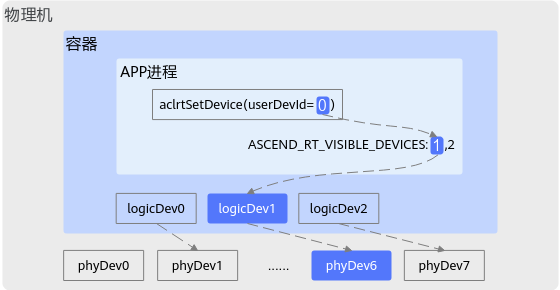

# 4. Device管理

本章节描述 CANN Runtime 的设备管理接口，用于设备的设置、重置、查询、同步及 P2P 访问等操作。

- [`aclError aclrtSetDevice(int32_t deviceId)`](#aclrtSetDevice)：指定当前线程中用于运算的Device。在不同线程中支持调用aclrtSetDevice接口指定同一个Device用于运算。
- [`aclError aclrtResetDevice(int32_t deviceId)`](#aclrtResetDevice)：复位当前运算的Device，释放Device上的资源。
- [`aclError aclrtResetDeviceForce(int32_t deviceId)`](#aclrtResetDeviceForce)：复位当前运算的Device，释放Device上的资源。
- [`aclError aclrtGetDevice(int32_t *deviceId)`](#aclrtGetDevice)：获取当前正在使用的Device的ID。
- [`aclError aclrtGetRunMode(aclrtRunMode *runMode)`](#aclrtGetRunMode)：获取当前AI软件栈的运行模式。
- [`aclError aclrtSetTsDevice(aclrtTsId tsId)`](#aclrtSetTsDevice)：设置本次计算需要使用的Task Schedule。
- [`aclError aclrtGetDeviceCount(uint32_t *count)`](#aclrtGetDeviceCount)：获取可用Device的数量。
- [`aclError aclrtGetDeviceUtilizationRate(int32_t deviceId, aclrtUtilizationInfo *utilizationInfo)`](#aclrtGetDeviceUtilizationRate)：查询Device上Cube、Vector、AI CPU等的利用率。
- [`aclError aclrtQueryDeviceStatus(int32_t deviceId, aclrtDeviceStatus *deviceStatus)`](#aclrtQueryDeviceStatus)：查询Device状态是正常可用、还是异常不可用。
- [`const char *aclrtGetSocName()`](#aclrtGetSocName)：查询当前运行环境的AI处理器版本。
- [`aclError aclrtSetDeviceSatMode(aclrtFloatOverflowMode mode)`](#aclrtSetDeviceSatMode)：设置当前Device的浮点计算结果输出模式。
- [`aclError aclrtGetDeviceSatMode(aclrtFloatOverflowMode *mode)`](#aclrtGetDeviceSatMode)：查询当前Device的浮点计算结果输出模式。
- [`aclError aclrtDeviceCanAccessPeer(int32_t *canAccessPeer, int32_t deviceId, int32_t peerDeviceId)`](#aclrtDeviceCanAccessPeer)：查询Device之间是否支持数据交互。
- [`aclError aclrtDeviceEnablePeerAccess(int32_t peerDeviceId, uint32_t flags)`](#aclrtDeviceEnablePeerAccess)：开启当前Device与指定Device之间的数据交互。开启数据交互是Device级的。
- [`aclError aclrtDeviceDisablePeerAccess(int32_t peerDeviceId)`](#aclrtDeviceDisablePeerAccess)：关闭当前Device与指定Device之间的数据交互功能。关闭数据交互功能是Device级的。
- [`aclError aclrtDevicePeerAccessStatus(int32_t deviceId, int32_t peerDeviceId, int32_t *status)`](#aclrtDevicePeerAccessStatus)：查询两个Device之间的数据交互状态。
- [`aclError aclrtGetOverflowStatus(void *outputAddr, size_t outputSize, aclrtStream stream)`](#aclrtGetOverflowStatus)：获取当前Device下所有Stream上任务的溢出状态，并将状态值拷贝到用户申请的Device内存中。异步接口。
- [`aclError aclrtResetOverflowStatus(aclrtStream stream)`](#aclrtResetOverflowStatus)：清除当前Device下所有Stream上任务的溢出状态。异步接口。
- [`aclError aclrtSynchronizeDevice(void)`](#aclrtSynchronizeDevice)：阻塞当前线程，直到与当前线程绑定的Context所对应的Device完成运算。
- [`aclError aclrtSynchronizeDeviceWithTimeout(int32_t timeout)`](#aclrtSynchronizeDeviceWithTimeout)：阻塞当前线程，直到与当前线程绑定的Context所对应的Device完成运算。
- [`aclError aclrtGetDeviceInfo(uint32_t deviceId, aclrtDevAttr attr, int64_t *value)`](#aclrtGetDeviceInfo)：获取指定Device的信息。
- [`aclError aclrtDeviceGetStreamPriorityRange(int32_t *leastPriority, int32_t *greatestPriority)`](#aclrtDeviceGetStreamPriorityRange)：查询硬件支持的Stream最低、最高优先级。
- [`aclError aclrtGetDeviceCapability(int32_t deviceId, aclrtDevFeatureType devFeatureType, int32_t *value)`](#aclrtGetDeviceCapability)：查询支持的特性信息。
- [`aclError aclrtGetDevicesTopo(uint32_t deviceId, uint32_t otherDeviceId, uint64_t *value)`](#aclrtGetDevicesTopo)：获取两个Device之间的网络拓扑关系。
- [`aclError aclrtRegDeviceStateCallback(const char *regName, aclrtDeviceStateCallback callback, void *args)`](#aclrtRegDeviceStateCallback)：注册Device状态回调函数，不支持重复注册。
- [`aclError aclrtGetLogicDevIdByUserDevId(const int32_t userDevid, int32_t *const logicDevId)`](#aclrtGetLogicDevIdByUserDevId)：根据用户设备ID获取对应的逻辑设备ID。
- [`aclError aclrtGetUserDevIdByLogicDevId(const int32_t logicDevId, int32_t *const userDevid)`](#aclrtGetUserDevIdByLogicDevId)：根据逻辑设备ID获取对应的用户设备ID。
- [`aclError aclrtGetLogicDevIdByPhyDevId(const int32_t phyDevId, int32_t *const logicDevId)`](#aclrtGetLogicDevIdByPhyDevId)：根据物理设备ID获取对应的逻辑设备ID。
- [`aclError aclrtGetPhyDevIdByLogicDevId(const int32_t logicDevId, int32_t *const phyDevId)`](#aclrtGetPhyDevIdByLogicDevId)：根据逻辑设备ID获取对应的物理设备ID。
- [`aclError aclrtDeviceGetUuid(int32_t deviceId, aclrtUuid *uuid)`](#aclrtDeviceGetUuid)：获取Device的唯一标识UUID（Universally Unique Identifier）。
- [`aclError aclrtDeviceGetBareTgid(int32_t *pid)`](#aclrtDeviceGetBareTgid)：获取当前进程的进程ID。
- [`aclError aclrtDeviceGetHostAtomicCapabilities(uint32_t* capabilities, const aclrtAtomicOperation* operations, const uint32_t count, int32_t deviceId)`](#aclrtDeviceGetHostAtomicCapabilities)：查询指定Device与Host之间支持的原子操作详情。
- [`aclError aclrtDeviceGetP2PAtomicCapabilities(uint32_t* capabilities, const aclrtAtomicOperation* operations, const uint32_t count, int32_t srcDeviceId, int32_t dstDeviceId)`](#aclrtDeviceGetP2PAtomicCapabilities)：查询一个AI Server内两个Device之间支持的原子操作详情。AI Server通常是多个Device组成的服务器形态的统称。


<a id="aclrtSetDevice"></a>

## aclrtSetDevice

```c
aclError aclrtSetDevice(int32_t deviceId)
```

### 产品支持情况


| 产品 | 是否支持 |
| --- | :---: |
| Ascend 950PR/Ascend 950DT | √ |
| Atlas A3 训练系列产品/Atlas A3 推理系列产品 | √ |
| Atlas A2 训练系列产品/Atlas A2 推理系列产品 | √ |

### 功能说明

指定当前线程中用于运算的Device。在不同线程中支持调用aclrtSetDevice接口指定同一个Device用于运算。

调用本接口会隐式创建默认Context，该默认Context中包含一个默认Stream。在同一个进程的多个线程中，如果调用aclrtSetDevice接口并指定相同的Device用于计算，那么这些线程将共享同一个默认Context。

### 参数说明


| 参数名 | 输入/输出 | 说明 |
| --- | :---: | --- |
| deviceId | 输入 | Device ID。<br>用户调用[aclrtGetDeviceCount](#aclrtGetDeviceCount)接口获取可用的Device数量后，这个Device ID的取值范围：[0, (可用的Device数量-1)] |

### 返回值说明

返回0表示成功，返回其他值表示失败，请参见[aclError](25_数据类型及其操作接口.md#aclError)。

### 约束说明

-   调用aclrtSetDevice接口指定运算的Device后，若不使用Device上的资源时，可调用[aclrtResetDevice](#aclrtResetDevice)或[aclrtResetDeviceForce](#aclrtResetDeviceForce)接口及时释放本进程使用的Device资源（若不调用Reset接口，进程退出时也会释放本进程使用的Device资源）：
    -   若调用[aclrtResetDevice](#aclrtResetDevice)接口释放Device资源：

        aclrtResetDevice接口内部涉及引用计数的实现，建议aclrtResetDevice接口与[aclrtSetDevice](#aclrtSetDevice)接口配对使用，aclrtSetDevice接口每被调用一次，则引用计数加一，aclrtResetDevice接口每被调用一次，则该引用计数减一，当引用计数减到0时，才会真正释放Device上的资源。

    -   若调用[aclrtResetDeviceForce](#aclrtResetDeviceForce)接口释放Device资源：

        aclrtResetDeviceForce接口可与aclrtSetDevice接口配对使用，也可不与aclrtSetDevice接口配对使用，若不配对使用，一个进程中，针对同一个Device，调用一次或多次aclrtSetDevice接口后，仅需调用一次aclrtResetDeviceForce接口可释放Device上的资源。

-   多Device场景下，可在进程中通过aclrtSetDevice接口切换到其它Device。


<br>
<br>
<br>


<a id="aclrtResetDevice"></a>

## aclrtResetDevice

```c
aclError aclrtResetDevice(int32_t deviceId)
```

### 产品支持情况


| 产品 | 是否支持 |
| --- | :---: |
| Ascend 950PR/Ascend 950DT | √ |
| Atlas A3 训练系列产品/Atlas A3 推理系列产品 | √ |
| Atlas A2 训练系列产品/Atlas A2 推理系列产品 | √ |

### 功能说明

复位当前运算的Device，释放Device上的资源。释放的资源包括默认Context、默认Stream以及默认Context下创建的所有Stream。若默认Context或默认Stream下的任务还未完成，系统会等待任务完成后再释放。

aclrtResetDevice接口内部涉及引用计数的实现，建议aclrtResetDevice接口与[aclrtSetDevice](#aclrtSetDevice)接口配对使用，aclrtSetDevice接口每被调用一次，则引用计数加一，aclrtResetDevice接口每被调用一次，则该引用计数减一，当引用计数减到0时，才会真正释放Device上的资源。

如果多次调用aclrtSetDevice接口而不调用aclrtResetDevice接口释放本线程使用的Device资源，进程退出时也会释放本进程使用的Device资源。

### 参数说明


| 参数名 | 输入/输出 | 说明 |
| --- | :---: | --- |
| deviceId | 输入 | Device ID。 |

### 返回值说明

返回0表示成功，返回其他值表示失败，请参见[aclError](25_数据类型及其操作接口.md#aclError)。

### 约束说明

若要复位的Device上存在显式创建的Context、Stream、Event，在复位前，建议遵循如下接口调用顺序，否则可能会导致业务异常。

**接口调用顺序**：调用[aclrtDestroyEvent](07_Event管理.md#aclrtDestroyEvent)接口释放Event/调用[aclrtDestroyStream](06_Stream管理.md#aclrtDestroyStream)接口释放显式创建的Stream**--\>**调用[aclrtDestroyContext](05_Context管理.md#aclrtDestroyContext)释放显式创建的Context**--\>**调用aclrtResetDevice接口


<br>
<br>
<br>


<a id="aclrtResetDeviceForce"></a>

## aclrtResetDeviceForce

```c
aclError aclrtResetDeviceForce(int32_t deviceId)
```

### 产品支持情况


| 产品 | 是否支持 |
| --- | :---: |
| Ascend 950PR/Ascend 950DT | √ |
| Atlas A3 训练系列产品/Atlas A3 推理系列产品 | √ |
| Atlas A2 训练系列产品/Atlas A2 推理系列产品 | √ |

### 功能说明

复位当前运算的Device，释放Device上的资源。释放的资源包括默认Context、默认Stream以及默认Context下创建的所有Stream。若默认Context或默认Stream下的任务还未完成，系统会等待任务完成后再释放。

aclrtResetDeviceForce接口可与aclrtSetDevice接口配对使用，也可不与aclrtSetDevice接口配对使用，若不配对使用，一个进程中，针对同一个Device，调用一次或多次aclrtSetDevice接口后，仅需调用一次aclrtResetDeviceForce接口可释放Device上的资源。

```
### 与aclrtSetDevice接口配对使用：
aclrtSetDevice(1) -> aclrtResetDeviceForce(1) -> aclrtSetDevice(1) -> aclrtResetDeviceForce(1)
 
### 与aclrtSetDevice接口不配对使用：
aclrtSetDevice(1) -> aclrtSetDevice(1) -> aclrtResetDeviceForce(1)
```

### 参数说明


| 参数名 | 输入/输出 | 说明 |
| --- | :---: | --- |
| deviceId | 输入 | Device ID。 |

### 返回值说明

返回0表示成功，返回其他值表示失败，请参见[aclError](25_数据类型及其操作接口.md#aclError)。

### 约束说明

-   多线程场景下，针对同一个Device，如果每个线程中都调用[aclrtSetDevice](#aclrtSetDevice)接口、aclrtResetDeviceForce接口，如下所示，线程2中的aclrtResetDeviceForce接口会返回报错，因为线程1中aclrtResetDeviceForce接口已经释放了Device 1的资源：

    ```
    时间线 ----------------------------------------------------------------------------->
    线程1：aclrtSetDevice(1)           aclrtResetDeviceForce(1)
    线程2：aclrtSetDevice(1)                                   aclrtResetDeviceForce(1)
    ```

    多线程场景下，正确方式是应在线程执行的最后，调用一次aclrtResetDeviceForce释放Device资源，如下所示：

    ```
    时间线 ----------------------------------------------------------------------------->
    线程1：aclrtSetDevice(1)    
    线程2：aclrtSetDevice(1)                                   aclrtResetDeviceForce(1)
    ```

-   [aclrtResetDevice](#aclrtResetDevice)接口与aclrtResetDeviceForce接口可以混用，但混用时，若两个Reset接口的调用次数、调用顺序不对，接口会返回报错。

    ```
    # 混用时的正确方式：
    # 两个Reset接口都分别与Set接口配对使用，且aclrtResetDeviceForce接口在aclrtResetDevice接口之后
    aclrtSetDevice(1) -> aclrtResetDevice(1) -> aclrtSetDevice(1) -> aclrtResetDeviceForce(1)
    aclrtSetDevice(1) -> aclrtSetDevice(1) -> aclrtResetDevice(1) -> aclrtResetDeviceForce(1)
    
    # 混用时的错误方式：
    # aclrtResetDevice接口内部涉及引用计数的实现，当aclrtResetDevice接口每被调用一次，则该引用计数减1，当引用计数减到0时，会真正释放Device上的资源，此时再调用aclrtResetDevice或aclrtResetDeviceForce接口都会报错
    aclrtSetDevice(1) -> aclrtSetDevice(1) -> aclrtResetDevice(1)-->aclrtResetDevice(1)-->aclrtResetDeviceForce(1)
    aclrtSetDevice(1) -> aclrtSetDevice(1) -> aclrtResetDevice(1)-->aclrtResetDeviceForce(1)-->aclrtResetDeviceForce(1)
    # aclrtResetDeviceForce接口在aclrtResetDevice接口之后，否则接口返回报错
    aclrtSetDevice(1) -> aclrtSetDevice(1) -> aclrtResetDeviceForce(1)-->aclrtResetDevice(1)
    ```


<br>
<br>
<br>


<a id="aclrtGetDevice"></a>

## aclrtGetDevice

```c
aclError aclrtGetDevice(int32_t *deviceId)
```

### 产品支持情况


| 产品 | 是否支持 |
| --- | :---: |
| Ascend 950PR/Ascend 950DT | √ |
| Atlas A3 训练系列产品/Atlas A3 推理系列产品 | √ |
| Atlas A2 训练系列产品/Atlas A2 推理系列产品 | √ |

### 功能说明

获取当前正在使用的Device的ID。

### 参数说明


| 参数名 | 输入/输出 | 说明 |
| --- | :---: | --- |
| deviceId | 输出 | Device ID的指针。 |

### 返回值说明

返回0表示成功，返回其他值表示失败，请参见[aclError](25_数据类型及其操作接口.md#aclError)。

### 约束说明

如果没有提前指定计算设备（例如调用[aclrtSetDevice](#aclrtSetDevice)接口），则调用aclrtGetDevice接口时，返回错误。


<br>
<br>
<br>


<a id="aclrtGetRunMode"></a>

## aclrtGetRunMode

```c
aclError aclrtGetRunMode(aclrtRunMode *runMode)
```

### 产品支持情况


| 产品 | 是否支持 |
| --- | :---: |
| Ascend 950PR/Ascend 950DT | √ |
| Atlas A3 训练系列产品/Atlas A3 推理系列产品 | √ |
| Atlas A2 训练系列产品/Atlas A2 推理系列产品 | √ |

### 功能说明

获取当前AI软件栈的运行模式。

### 参数说明


| 参数名 | 输入/输出 | 说明 |
| --- | :---: | --- |
| runMode | 输出 | 运行模式的指针。类型定义请参见[aclrtRunMode](25_数据类型及其操作接口.md#aclrtRunMode)。 |

### 返回值说明

返回0表示成功，返回其他值表示失败，请参见[aclError](25_数据类型及其操作接口.md#aclError)。


<br>
<br>
<br>


<a id="aclrtSetTsDevice"></a>

## aclrtSetTsDevice

```c
aclError aclrtSetTsDevice(aclrtTsId tsId)
```

### 产品支持情况


| 产品 | 是否支持 |
| --- | :---: |
| Ascend 950PR/Ascend 950DT | √ |
| Atlas A3 训练系列产品/Atlas A3 推理系列产品 | √ |
| Atlas A2 训练系列产品/Atlas A2 推理系列产品 | √ |

### 功能说明

设置本次计算需要使用的Task Schedule。

### 参数说明


| 参数名 | 输入/输出 | 说明 |
| --- | :---: | --- |
| tsId | 输入 | 指定本次计算需要使用的Task Schedule。如果AI处理器中只有AI CORE Task Schedule，没有VECTOR Core Task Schedule，则设置该参数无效，默认使用AI CORE Task Schedule。<br>typedef enum aclrtTsId {<br>   ACL_TS_ID_AICORE  = 0, //使用AI CORE Task Schedule<br>   ACL_TS_ID_AIVECTOR = 1, //使用VECTOR Core Task Schedule<br>   ACL_TS_ID_RESERVED = 2,<br>} aclrtTsId; |

### 返回值说明

返回0表示成功，返回其他值表示失败，请参见[aclError](25_数据类型及其操作接口.md#aclError)。


<br>
<br>
<br>


<a id="aclrtGetDeviceCount"></a>

## aclrtGetDeviceCount

```c
aclError aclrtGetDeviceCount(uint32_t *count)
```

### 产品支持情况


| 产品 | 是否支持 |
| --- | :---: |
| Ascend 950PR/Ascend 950DT | √ |
| Atlas A3 训练系列产品/Atlas A3 推理系列产品 | √ |
| Atlas A2 训练系列产品/Atlas A2 推理系列产品 | √ |

### 功能说明

获取可用Device的数量。

### 参数说明


| 参数名 | 输入/输出 | 说明 |
| --- | :---: | --- |
| count | 输出 | Device数量的指针。 |

### 返回值说明

返回0表示成功，返回其他值表示失败，请参见[aclError](25_数据类型及其操作接口.md#aclError)。


<br>
<br>
<br>


<a id="aclrtGetDeviceUtilizationRate"></a>

## aclrtGetDeviceUtilizationRate

```c
aclError aclrtGetDeviceUtilizationRate(int32_t deviceId, aclrtUtilizationInfo *utilizationInfo)
```

### 产品支持情况


| 产品 | 是否支持 |
| --- | :---: |
| Ascend 950PR/Ascend 950DT | √ |
| Atlas A3 训练系列产品/Atlas A3 推理系列产品 | √ |
| Atlas A2 训练系列产品/Atlas A2 推理系列产品 | √ |

### 功能说明

查询Device上Cube、Vector、AI CPU等的利用率。

### 参数说明


| 参数名 | 输入/输出 | 说明 |
| --- | :---: | --- |
| deviceId | 输入 | Device ID。<br>用户调用[aclrtGetDeviceCount](#aclrtGetDeviceCount)接口获取可用的Device数量后，这个Device ID的取值范围：[0, (可用的Device数量-1)] |
| utilizationInfo | 输出 | 利用率信息结构体指针。类型定义定参见[aclrtUtilizationInfo](25_数据类型及其操作接口.md#aclrtUtilizationInfo)。 |

### 返回值说明

返回0表示成功，返回其他值表示失败，请参见[aclError](25_数据类型及其操作接口.md#aclError)。

### 约束说明

-   当使用本接口查询Vector利用率时，如果查询结果为-1，则表示Vector不存在。
-   当前版本不支持查询Device内存利用率，若通过本接口查询内存利用率，返回的利用率为-1。
-   开启Profiling功能时，不支持调用本接口查询利用率，接口返回值无实际意义。
-   昇腾虚拟化实例场景下，不支持调用本接口查询利用率，接口返回值无实际意义。


<br>
<br>
<br>


<a id="aclrtQueryDeviceStatus"></a>

## aclrtQueryDeviceStatus

```c
aclError aclrtQueryDeviceStatus(int32_t deviceId, aclrtDeviceStatus *deviceStatus)
```

### 产品支持情况


| 产品 | 是否支持 |
| --- | :---: |
| Ascend 950PR/Ascend 950DT | √ |
| Atlas A3 训练系列产品/Atlas A3 推理系列产品 | √ |
| Atlas A2 训练系列产品/Atlas A2 推理系列产品 | √ |

### 功能说明

查询Device状态是正常可用、还是异常不可用。

### 参数说明


| 参数名 | 输入/输出 | 说明 |
| --- | :---: | --- |
| deviceId | 输入 | Device ID。<br>用户调用[aclrtGetDeviceCount](#aclrtGetDeviceCount)接口获取可用的Device数量后，这个Device ID的取值范围：[0, (可用的Device数量-1)] |
| deviceStatus | 输出 | Device状态。类型定义请参见[aclrtDeviceStatus](25_数据类型及其操作接口.md#aclrtDeviceStatus)。 |

### 返回值说明

返回0表示成功，返回其他值表示失败，请参见[aclError](25_数据类型及其操作接口.md#aclError)。


<br>
<br>
<br>


<a id="aclrtGetSocName"></a>

## aclrtGetSocName

```c
const char *aclrtGetSocName()
```

### 产品支持情况


| 产品 | 是否支持 |
| --- | :---: |
| Ascend 950PR/Ascend 950DT | √ |
| Atlas A3 训练系列产品/Atlas A3 推理系列产品 | √ |
| Atlas A2 训练系列产品/Atlas A2 推理系列产品 | √ |

### 功能说明

查询当前运行环境的AI处理器版本。

### 参数说明

无

### 返回值说明

返回AI处理器版本字符串的指针。如果通过该接口获取芯片版本失败，则返回空指针。


<br>
<br>
<br>


<a id="aclrtSetDeviceSatMode"></a>

## aclrtSetDeviceSatMode

```c
aclError aclrtSetDeviceSatMode(aclrtFloatOverflowMode mode)
```

### 产品支持情况


| 产品 | 是否支持 |
| --- | :---: |
| Ascend 950PR/Ascend 950DT | √ |
| Atlas A3 训练系列产品/Atlas A3 推理系列产品 | √ |
| Atlas A2 训练系列产品/Atlas A2 推理系列产品 | √ |

### 功能说明

设置当前Device的浮点计算结果输出模式。

调用该接口成功后，后续在该Device上新创建的Stream按设置的模式生效，对之前已创建的Stream不生效。

### 参数说明


| 参数名 | 输入/输出 | 说明 |
| --- | :---: | --- |
| mode | 输入 | 设置浮点计算结果输出模式。类型定义请参见[aclrtFloatOverflowMode](25_数据类型及其操作接口.md#aclrtFloatOverflowMode)。 |

### 返回值说明

返回0表示成功，返回其他值表示失败，请参见[aclError](25_数据类型及其操作接口.md#aclError)。


<br>
<br>
<br>


<a id="aclrtGetDeviceSatMode"></a>

## aclrtGetDeviceSatMode

```c
aclError aclrtGetDeviceSatMode(aclrtFloatOverflowMode *mode)
```

### 产品支持情况


| 产品 | 是否支持 |
| --- | :---: |
| Ascend 950PR/Ascend 950DT | √ |
| Atlas A3 训练系列产品/Atlas A3 推理系列产品 | √ |
| Atlas A2 训练系列产品/Atlas A2 推理系列产品 | √ |

### 功能说明

查询当前Device的浮点计算结果输出模式。

### 参数说明


| 参数名 | 输入/输出 | 说明 |
| --- | :---: | --- |
| mode | 输出 | 获取浮点计算结果输出模式。类型定义请参见[aclrtFloatOverflowMode](25_数据类型及其操作接口.md#aclrtFloatOverflowMode)。 |

### 返回值说明

返回0表示成功，返回其他值表示失败，请参见[aclError](25_数据类型及其操作接口.md#aclError)。


<br>
<br>
<br>


<a id="aclrtDeviceCanAccessPeer"></a>

## aclrtDeviceCanAccessPeer

```c
aclError aclrtDeviceCanAccessPeer(int32_t *canAccessPeer, int32_t deviceId, int32_t peerDeviceId)
```

### 产品支持情况


| 产品 | 是否支持 |
| --- | :---: |
| Ascend 950PR/Ascend 950DT | √ |
| Atlas A3 训练系列产品/Atlas A3 推理系列产品 | √ |
| Atlas A2 训练系列产品/Atlas A2 推理系列产品 | √ |

### 功能说明

查询Device之间是否支持数据交互。

### 参数说明


| 参数名 | 输入/输出 | 说明 |
| --- | :---: | --- |
| canAccessPeer | 输出 | 是否支持数据交互，1表示支持，0表示不支持。 |
| deviceId | 输入 | 指定Device的ID，不能与peerDeviceId参数值相同。<br>用户调用[aclrtGetDeviceCount](#aclrtGetDeviceCount)接口获取可用的Device数量后，这个Device ID的取值范围：[0, (可用的Device数量-1)] |
| peerDeviceId | 输入 | 指定Device的ID，不能与deviceId参数值相同。<br>用户调用[aclrtGetDeviceCount](#aclrtGetDeviceCount)接口获取可用的Device数量后，这个Device ID的取值范围：[0, (可用的Device数量-1)] |

### 返回值说明

返回0表示成功，返回其他值表示失败，请参见[aclError](25_数据类型及其操作接口.md#aclError)。

### 约束说明

-   仅支持物理机和容器场景；
-   仅支持同一个PCIe Switch内Device之间的数据交互。AI Server场景下，虽然是跨PCIe Switch，但也支持Device之间的数据交互。
-   仅支持同一个物理机或容器内的Device之间的数据交互操作。
-   仅支持同一个进程内、线程间的Device之间的数据交互，不支持不同进程间Device之间的数据交互。


<br>
<br>
<br>


<a id="aclrtDeviceEnablePeerAccess"></a>

## aclrtDeviceEnablePeerAccess

```c
aclError aclrtDeviceEnablePeerAccess(int32_t peerDeviceId, uint32_t flags)
```

### 产品支持情况


| 产品 | 是否支持 |
| --- | :---: |
| Ascend 950PR/Ascend 950DT | √ |
| Atlas A3 训练系列产品/Atlas A3 推理系列产品 | √ |
| Atlas A2 训练系列产品/Atlas A2 推理系列产品 | √ |

### 功能说明

开启当前Device与指定Device之间的数据交互。开启数据交互是Device级的。

调用本接口开启Device之间的数据交互是单向的。例如，当前Device ID为0，调用aclrtDeviceEnablePeerAccess接口指定Device ID为1后，仅Device 0到Device 1方向的数据交互是可行的。若要启用Device 1到Device 0方向的数据交互，则需将当前Device切换至Device 1，并再次调用aclrtDeviceEnablePeerAccess接口指定Device ID 0，此时Device 1到Device 0方向的数据交互才能实现。

可提前调用[aclrtDeviceCanAccessPeer](#aclrtDeviceCanAccessPeer)接口查询当前Device与指定Device之间能否进行数据交互。开启Device间的数据交互功能后，若想关闭该功能，可调用[aclrtDeviceDisablePeerAccess](#aclrtDeviceDisablePeerAccess)接口。

### 参数说明


| 参数名 | 输入/输出 | 说明 |
| --- | :---: | --- |
| peerDeviceId | 输入 | 指定Device ID，该ID不能与当前Device的ID相同。<br>用户调用[aclrtGetDeviceCount](#aclrtGetDeviceCount)接口获取可用的Device数量后，这个Device ID的取值范围：[0, (可用的Device数量-1)] |
| flags | 输入 | 保留参数，当前必须设置为0。 |

### 返回值说明

返回0表示成功，返回其他值表示失败，请参见[aclError](25_数据类型及其操作接口.md#aclError)。


<br>
<br>
<br>


<a id="aclrtDeviceDisablePeerAccess"></a>

## aclrtDeviceDisablePeerAccess

```c
aclError aclrtDeviceDisablePeerAccess(int32_t peerDeviceId)
```

### 产品支持情况


| 产品 | 是否支持 |
| --- | :---: |
| Ascend 950PR/Ascend 950DT | √ |
| Atlas A3 训练系列产品/Atlas A3 推理系列产品 | √ |
| Atlas A2 训练系列产品/Atlas A2 推理系列产品 | √ |

### 功能说明

关闭当前Device与指定Device之间的数据交互功能。关闭数据交互功能是Device级的。

调用[aclrtDeviceEnablePeerAccess](#aclrtDeviceEnablePeerAccess)接口开启当前Device与指定Device之间的数据交互后，可调用aclrtDeviceDisablePeerAccess接口关闭数据交互功能。

### 参数说明


| 参数名 | 输入/输出 | 说明 |
| --- | :---: | --- |
| peerDeviceId | 输入 | Device ID，该ID不能与当前Device的ID相同。<br>用户调用[aclrtGetDeviceCount](#aclrtGetDeviceCount)接口获取可用的Device数量后，这个Device ID的取值范围：[0, (可用的Device数量-1)] |

### 返回值说明

返回0表示成功，返回其他值表示失败，请参见[aclError](25_数据类型及其操作接口.md#aclError)。


<br>
<br>
<br>


<a id="aclrtDevicePeerAccessStatus"></a>

## aclrtDevicePeerAccessStatus

```c
aclError aclrtDevicePeerAccessStatus(int32_t deviceId, int32_t peerDeviceId, int32_t *status)
```

### 产品支持情况


| 产品 | 是否支持 |
| --- | :---: |
| Ascend 950PR/Ascend 950DT | √ |
| Atlas A3 训练系列产品/Atlas A3 推理系列产品 | √ |
| Atlas A2 训练系列产品/Atlas A2 推理系列产品 | √ |

### 功能说明

查询两个Device之间的数据交互状态。

### 参数说明


| 参数名 | 输入/输出 | 说明 |
| --- | :---: | --- |
| deviceId | 输入 | 指定Device的ID。<br>用户调用[aclrtGetDeviceCount](#aclrtGetDeviceCount)接口获取可用的Device数量后，这个Device ID的取值范围：[0, (可用的Device数量-1)] |
| peerDeviceId | 输入 | 指定Device的ID。<br>用户调用[aclrtGetDeviceCount](#aclrtGetDeviceCount)接口获取可用的Device数量后，这个Device ID的取值范围：[0, (可用的Device数量-1)] |
| status | 输出 | 设备状态。0表示未开启数据交互；1表示已开启数据交互。 |

### 返回值说明

返回0表示成功，返回其他值表示失败，请参见[aclError](25_数据类型及其操作接口.md#aclError)。


<br>
<br>
<br>


<a id="aclrtGetOverflowStatus"></a>

## aclrtGetOverflowStatus

```c
aclError aclrtGetOverflowStatus(void *outputAddr, size_t outputSize, aclrtStream stream)
```

### 产品支持情况


| 产品 | 是否支持 |
| --- | :---: |
| Ascend 950PR/Ascend 950DT | √ |
| Atlas A3 训练系列产品/Atlas A3 推理系列产品 | √ |
| Atlas A2 训练系列产品/Atlas A2 推理系列产品 | √ |

### 功能说明

获取当前Device下所有Stream上任务的溢出状态，并将状态值拷贝到用户申请的Device内存中。异步接口。

### 参数说明


| 参数名 | 输入/输出 | 说明 |
| --- | :---: | --- |
| outputAddr | 输入&输出 | 用户申请的Device内存，例如通过aclrtMalloc接口申请。 |
| outputSize | 输入 | 需申请的Device内存大小，单位Byte，固定大小为64Byte。 |
| stream | 输入 | 指定Stream，用于下发溢出状态查询任务。类型定义请参见[aclrtStream](25_数据类型及其操作接口.md#aclrtStream)。 |

### 返回值说明

返回0表示成功，返回其他值表示失败，请参见[aclError](25_数据类型及其操作接口.md#aclError)。

### 约束说明

对于以下产品型号，调用本接口查询出来的溢出状态是进程级别的：

-   Ascend 950PR/Ascend 950DT
-   Atlas A3 训练系列产品/Atlas A3 推理系列产品
-   Atlas A2 训练系列产品/Atlas A2 推理系列产品


<br>
<br>
<br>


<a id="aclrtResetOverflowStatus"></a>

## aclrtResetOverflowStatus

```c
aclError aclrtResetOverflowStatus(aclrtStream stream)
```

### 产品支持情况


| 产品 | 是否支持 |
| --- | :---: |
| Ascend 950PR/Ascend 950DT | √ |
| Atlas A3 训练系列产品/Atlas A3 推理系列产品 | √ |
| Atlas A2 训练系列产品/Atlas A2 推理系列产品 | √ |

### 功能说明

清除当前Device下所有Stream上任务的溢出状态。异步接口。

### 参数说明


| 参数名 | 输入/输出 | 说明 |
| --- | :---: | --- |
| stream | 输入 | 指定Stream，用于下发溢出状态复位任务。类型定义请参见[aclrtStream](25_数据类型及其操作接口.md#aclrtStream)。 |

### 返回值说明

返回0表示成功，返回其他值表示失败，请参见[aclError](25_数据类型及其操作接口.md#aclError)。

### 约束说明

对于以下产品型号，调用本接口清除的溢出状态是进程级别的：

-   Ascend 950PR/Ascend 950DT
-   Atlas A3 训练系列产品/Atlas A3 推理系列产品
-   Atlas A2 训练系列产品/Atlas A2 推理系列产品


<br>
<br>
<br>


<a id="aclrtSynchronizeDevice"></a>

## aclrtSynchronizeDevice

```c
aclError aclrtSynchronizeDevice(void)
```

### 产品支持情况


| 产品 | 是否支持 |
| --- | :---: |
| Ascend 950PR/Ascend 950DT | √ |
| Atlas A3 训练系列产品/Atlas A3 推理系列产品 | √ |
| Atlas A2 训练系列产品/Atlas A2 推理系列产品 | √ |

### 功能说明

阻塞当前线程，直到与当前线程绑定的Context所对应的Device完成运算。

### 参数说明

无

### 返回值说明

返回0表示成功，返回其他值表示失败，请参见[aclError](25_数据类型及其操作接口.md#aclError)。


<br>
<br>
<br>


<a id="aclrtSynchronizeDeviceWithTimeout"></a>

## aclrtSynchronizeDeviceWithTimeout

```c
aclError aclrtSynchronizeDeviceWithTimeout(int32_t timeout)
```

### 产品支持情况


| 产品 | 是否支持 |
| --- | :---: |
| Ascend 950PR/Ascend 950DT | √ |
| Atlas A3 训练系列产品/Atlas A3 推理系列产品 | √ |
| Atlas A2 训练系列产品/Atlas A2 推理系列产品 | √ |

### 功能说明

阻塞当前线程，直到与当前线程绑定的Context所对应的Device完成运算。该接口是在[aclrtSynchronizeDevice](#aclrtSynchronizeDevice)接口基础上进行了增强，支持用户设置超时时间，当应用程序异常时可根据所设置的超时时间自行退出，超时退出时本接口返回ACL\_ERROR\_RT\_STREAM\_SYNC\_TIMEOUT。

多Device场景下，调用该接口等待的是当前Context对应的Device。

### 参数说明


| 参数名 | 输入/输出 | 说明 |
| --- | :---: | --- |
| timeout | 输入 | 接口的超时时间。<br>取值说明如下：<br><br>  - -1：表示永久等待，和接口[aclrtSynchronizeDevice](#aclrtSynchronizeDevice)功能一样；<br>  - >0：配置具体的超时时间，单位是毫秒。 |

### 返回值说明

返回0表示成功，返回其他值表示失败，请参见[aclError](25_数据类型及其操作接口.md#aclError)。


<br>
<br>
<br>


<a id="aclrtGetDeviceInfo"></a>

## aclrtGetDeviceInfo

```c
aclError aclrtGetDeviceInfo(uint32_t deviceId, aclrtDevAttr attr, int64_t *value)
```

### 产品支持情况


| 产品 | 是否支持 |
| --- | :---: |
| Ascend 950PR/Ascend 950DT | √ |
| Atlas A3 训练系列产品/Atlas A3 推理系列产品 | √ |
| Atlas A2 训练系列产品/Atlas A2 推理系列产品 | √ |

### 功能说明

获取指定Device的信息。

### 参数说明


| 参数名 | 输入/输出 | 说明 |
| --- | :---: | --- |
| deviceId | 输入 | Device ID。<br>用户调用[aclrtGetDeviceCount](#aclrtGetDeviceCount)接口获取可用的Device数量后，这个Device ID的取值范围：[0, (可用的Device数量-1)]。 |
| attr | 输入 | 属性。类型定义请参见[aclrtDevAttr](25_数据类型及其操作接口.md#aclrtDevAttr)。 |
| value | 输出 | 属性值。 |

### 返回值说明

返回0表示成功，返回其他值表示失败，请参见[aclError](25_数据类型及其操作接口.md#aclError)。


<br>
<br>
<br>


<a id="aclrtDeviceGetStreamPriorityRange"></a>

## aclrtDeviceGetStreamPriorityRange

```c
aclError aclrtDeviceGetStreamPriorityRange(int32_t *leastPriority, int32_t *greatestPriority)
```

### 产品支持情况


| 产品 | 是否支持 |
| --- | :---: |
| Ascend 950PR/Ascend 950DT | √ |
| Atlas A3 训练系列产品/Atlas A3 推理系列产品 | √ |
| Atlas A2 训练系列产品/Atlas A2 推理系列产品 | √ |

### 功能说明

查询硬件支持的Stream最低、最高优先级。

### 参数说明


| 参数名 | 输入/输出 | 说明 |
| --- | :---: | --- |
| leastPriority | 输出 | 最低优先级。 |
| greatestPriority | 输出 | 最高优先级。 |

### 返回值说明

返回0表示成功，返回其他值表示失败，请参见[aclError](25_数据类型及其操作接口.md#aclError)。


<br>
<br>
<br>


<a id="aclrtGetDeviceCapability"></a>

## aclrtGetDeviceCapability

```c
aclError aclrtGetDeviceCapability(int32_t deviceId, aclrtDevFeatureType devFeatureType, int32_t *value)
```

### 产品支持情况


| 产品 | 是否支持 |
| --- | :---: |
| Ascend 950PR/Ascend 950DT | √ |
| Atlas A3 训练系列产品/Atlas A3 推理系列产品 | √ |
| Atlas A2 训练系列产品/Atlas A2 推理系列产品 | √ |

### 功能说明

查询支持的特性信息。

### 参数说明


| 参数名 | 输入/输出 | 说明 |
| --- | :---: | --- |
| deviceId | 输入 | Device ID。<br>用户调用[aclrtGetDeviceCount](#aclrtGetDeviceCount)接口获取可用的Device数量后，这个Device ID的取值范围：[0, (可用的Device数量-1)]。 |
| devFeatureType | 输入 | 特性类型。类型定义请参见[aclrtDevFeatureType](25_数据类型及其操作接口.md#aclrtDevFeatureType)。 |
| value | 输出 | 特性是否支持。<br><br>  - ACL_DEV_FEATURE_NOT_SUPPORT(0)：不支持<br>  - ACL_DEV_FEATURE_SUPPORT(1)：支持<br><br><br>相关宏定义如下：<br>#define ACL_DEV_FEATURE_SUPPORT  0x00000001<br>#define ACL_DEV_FEATURE_NOT_SUPPORT 0x00000000 |

### 返回值说明

返回0表示成功，返回其他值表示失败，请参见[aclError](25_数据类型及其操作接口.md#aclError)。


<br>
<br>
<br>


<a id="aclrtGetDevicesTopo"></a>

## aclrtGetDevicesTopo

```c
aclError aclrtGetDevicesTopo(uint32_t deviceId, uint32_t otherDeviceId, uint64_t *value)
```

### 产品支持情况


| 产品 | 是否支持 |
| --- | :---: |
| Ascend 950PR/Ascend 950DT | √ |
| Atlas A3 训练系列产品/Atlas A3 推理系列产品 | √ |
| Atlas A2 训练系列产品/Atlas A2 推理系列产品 | √ |

### 功能说明

获取两个Device之间的网络拓扑关系。

### 参数说明


| 参数名 | 输入/输出 | 说明 |
| --- | :---: | --- |
| deviceId | 输入 | 指定Device的ID。<br>用户调用[aclrtGetDeviceCount](#aclrtGetDeviceCount)接口获取可用的Device数量后，这个Device ID的取值范围：[0, (可用的Device数量-1)] |
| otherDeviceId | 输入 | 指定Device的ID。<br>用户调用[aclrtGetDeviceCount](#aclrtGetDeviceCount)接口获取可用的Device数量后，这个Device ID的取值范围：[0, (可用的Device数量-1)] |
| value | 输出 | 两个Device之间互联的拓扑关系。<br><br>  - ACL_RT_DEVS_TOPOLOGY_HCCS：通过HCCS连接。HCCS是Huawei Cache Coherence System（华为缓存一致性系统），用于CPU/NPU之间的高速互联。<br>  - ACL_RT_DEVS_TOPOLOGY_PIX：通过同一个PCIe Switch连接。<br>  - ACL_RT_DEVS_TOPOLOGY_PHB：通过PCIe Host Bridge连接。<br>  - ACL_RT_DEVS_TOPOLOGY_SYS：通过SMP（Symmetric Multiprocessing）连接，NUMA节点之间通过SMP互连。<br>  - ACL_RT_DEVS_TOPOLOGY_SIO：片内连接方式，两个DIE之间通过该方式连接。<br>  - ACL_RT_DEVS_TOPOLOGY_HCCS_SW：通过HCCS Switch连接。<br>  - ACL_RT_DEVS_TOPOLOGY_PIB：预留值，暂不支持。<br><br>宏定义如下：<br>#define ACL_RT_DEVS_TOPOLOGY_HCCS  0x01ULL<br>#define ACL_RT_DEVS_TOPOLOGY_PIX  0x02ULL<br>#define ACL_RT_DEVS_TOPOLOGY_PHB  0x08ULL<br>#define ACL_RT_DEVS_TOPOLOGY_SYS  0x10ULL<br>#define ACL_RT_DEVS_TOPOLOGY_SIO  0x20ULL<br>#define ACL_RT_DEVS_TOPOLOGY_HCCS_SW  0x40ULL<br>#define ACL_RT_DEVS_TOPOLOGY_PIB  0x04ULL |

### 返回值说明

返回0表示成功，返回其他值表示失败，请参见[aclError](25_数据类型及其操作接口.md#aclError)。


<br>
<br>
<br>


<a id="aclrtRegDeviceStateCallback"></a>

## aclrtRegDeviceStateCallback

```c
aclError aclrtRegDeviceStateCallback(const char *regName, aclrtDeviceStateCallback callback, void *args)
```

### 产品支持情况


| 产品 | 是否支持 |
| --- | :---: |
| Ascend 950PR/Ascend 950DT | √ |
| Atlas A3 训练系列产品/Atlas A3 推理系列产品 | √ |
| Atlas A2 训练系列产品/Atlas A2 推理系列产品 | √ |

### 功能说明

注册Device状态回调函数，不支持重复注册。

当Device状态发生变化时（例如调用[aclrtSetDevice](#aclrtSetDevice)、[aclrtResetDevice](#aclrtResetDevice)等接口），Runtime模块会触发该回调函数的调用。

### 参数说明


| 参数名 | 输入/输出 | 说明 |
| --- | :---: | --- |
| regName | 输入 | 注册名称，保持唯一，不能为空，输入保证字符串以\0结尾。 |
| callback | 输入 | 回调函数。若callback不为NULL，则表示注册回调函数；若为NULL，则表示取消注册回调函数。<br>回调函数的函数原型为：<br>typedef enum {<br>   ACL_RT_DEVICE_STATE_SET_PRE = 0, // 调用set接口（例如aclrtSetDevice）之前<br>   ACL_RT_DEVICE_STATE_SET_POST,  // 调用set接口（例如aclrtSetDevice）之后<br>   ACL_RT_DEVICE_STATE_RESET_PRE,  // 调用reset接口（例如aclrtResetDevice）之前<br>   ACL_RT_DEVICE_STATE_RESET_POST, // 调用reset接口（例如aclrtResetDevice）之后<br>} aclrtDeviceState;<br>typedef void (*aclrtDeviceStateCallback)(uint32_t devId, aclrtDeviceState state, void *args); |
| args | 输入 | 待传递给回调函数的用户数据的指针。 |

### 返回值说明

返回0表示成功，返回其他值表示失败，请参见[aclError](25_数据类型及其操作接口.md#aclError)。


<br>
<br>
<br>


<a id="aclrtGetLogicDevIdByUserDevId"></a>

## aclrtGetLogicDevIdByUserDevId

```c
aclError aclrtGetLogicDevIdByUserDevId(const int32_t userDevid, int32_t *const logicDevId)
```

### 产品支持情况


| 产品 | 是否支持 |
| --- | :---: |
| Ascend 950PR/Ascend 950DT | √ |
| Atlas A3 训练系列产品/Atlas A3 推理系列产品 | √ |
| Atlas A2 训练系列产品/Atlas A2 推理系列产品 | √ |

### 功能说明

根据用户设备ID获取对应的逻辑设备ID。

### 参数说明


| 参数名 | 输入/输出 | 说明 |
| --- | :---: | --- |
| userDevid | 输入 | 用户设备ID。 |
| logicDevId | 输出 | 逻辑设备ID。 |

### 返回值说明

返回0表示成功，返回其他值表示失败，请参见[aclError](25_数据类型及其操作接口.md#aclError)。

### 用户设备ID、逻辑设备ID、物理设备ID之间的关系

若未设置ASCEND\_RT\_VISIBLE\_DEVICES环境变量，逻辑设备ID与用户设备ID相同；若在非容器场景下，物理设备ID与逻辑设备ID相同。

下图以容器场景且设置ASCEND\_RT\_VISIBLE\_DEVICES环境变量为例说明三者之间的关系：通过ASCEND\_RT\_VISIBLE\_DEVICES环境变量设置的Device ID依次为**1**、2，对应的Device索引值依次为**0**、1，通过[aclrtSetDevice](#aclrtSetDevice)接口设置的用户设备ID为**0**，即对应的Device索引值为**0**，因此用户设备ID=**0**对应逻辑设备ID=**1**，容器中的逻辑设备ID=**1**又映射到物理设备ID=**6**，因此最终是使用ID为6的物理设备进行计算。



关于ASCEND\_RT\_VISIBLE\_DEVICES环境的详细介绍请参见《环境变量参考》。


<br>
<br>
<br>


<a id="aclrtGetUserDevIdByLogicDevId"></a>

## aclrtGetUserDevIdByLogicDevId

```c
aclError aclrtGetUserDevIdByLogicDevId(const int32_t logicDevId, int32_t *const userDevid)
```

### 产品支持情况


| 产品 | 是否支持 |
| --- | :---: |
| Ascend 950PR/Ascend 950DT | √ |
| Atlas A3 训练系列产品/Atlas A3 推理系列产品 | √ |
| Atlas A2 训练系列产品/Atlas A2 推理系列产品 | √ |

### 功能说明

根据逻辑设备ID获取对应的用户设备ID。

### 参数说明


| 参数名 | 输入/输出 | 说明 |
| --- | :---: | --- |
| logicDevId | 输入 | 逻辑设备ID。 |
| userDevid | 输出 | 用户设备ID。 |

### 返回值说明

返回0表示成功，返回其他值表示失败，请参见[aclError](25_数据类型及其操作接口.md#aclError)。

### 用户设备ID、逻辑设备ID、物理设备ID之间的关系

若未设置ASCEND\_RT\_VISIBLE\_DEVICES环境变量，逻辑设备ID与用户设备ID相同；若在非容器场景下，物理设备ID与逻辑设备ID相同。

下图以容器场景且设置ASCEND\_RT\_VISIBLE\_DEVICES环境变量为例说明三者之间的关系：通过ASCEND\_RT\_VISIBLE\_DEVICES环境变量设置的Device ID依次为**1**、2，对应的Device索引值依次为**0**、1，通过[aclrtSetDevice](#aclrtSetDevice)接口设置的用户设备ID为**0**，即对应的Device索引值为**0**，因此用户设备ID=**0**对应逻辑设备ID=**1**，容器中的逻辑设备ID=**1**又映射到物理设备ID=**6**，因此最终是使用ID为6的物理设备进行计算。


关于ASCEND\_RT\_VISIBLE\_DEVICES环境的详细介绍请参见《环境变量参考》。


<br>
<br>
<br>


<a id="aclrtGetLogicDevIdByPhyDevId"></a>

## aclrtGetLogicDevIdByPhyDevId

```c
aclError aclrtGetLogicDevIdByPhyDevId(const int32_t phyDevId, int32_t *const logicDevId)
```

### 产品支持情况


| 产品 | 是否支持 |
| --- | :---: |
| Ascend 950PR/Ascend 950DT | √ |
| Atlas A3 训练系列产品/Atlas A3 推理系列产品 | √ |
| Atlas A2 训练系列产品/Atlas A2 推理系列产品 | √ |

### 功能说明

根据物理设备ID获取对应的逻辑设备ID。

### 参数说明


| 参数名 | 输入/输出 | 说明 |
| --- | :---: | --- |
| phyDevId | 输入 | 物理设备ID。 |
| logicDevId | 输出 | 逻辑设备ID。 |

### 返回值说明

返回0表示成功，返回其他值表示失败，请参见[aclError](25_数据类型及其操作接口.md#aclError)。

### 用户设备ID、逻辑设备ID、物理设备ID之间的关系

若未设置ASCEND\_RT\_VISIBLE\_DEVICES环境变量，逻辑设备ID与用户设备ID相同；若在非容器场景下，物理设备ID与逻辑设备ID相同。

下图以容器场景且设置ASCEND\_RT\_VISIBLE\_DEVICES环境变量为例说明三者之间的关系：通过ASCEND\_RT\_VISIBLE\_DEVICES环境变量设置的Device ID依次为**1**、2，对应的Device索引值依次为**0**、1，通过[aclrtSetDevice](#aclrtSetDevice)接口设置的用户设备ID为**0**，即对应的Device索引值为**0**，因此用户设备ID=**0**对应逻辑设备ID=**1**，容器中的逻辑设备ID=**1**又映射到物理设备ID=**6**，因此最终是使用ID为6的物理设备进行计算。


关于ASCEND\_RT\_VISIBLE\_DEVICES环境的详细介绍请参见《环境变量参考》。


<br>
<br>
<br>


<a id="aclrtGetPhyDevIdByLogicDevId"></a>

## aclrtGetPhyDevIdByLogicDevId

```c
aclError aclrtGetPhyDevIdByLogicDevId(const int32_t logicDevId, int32_t *const phyDevId)
```

### 产品支持情况


| 产品 | 是否支持 |
| --- | :---: |
| Ascend 950PR/Ascend 950DT | √ |
| Atlas A3 训练系列产品/Atlas A3 推理系列产品 | √ |
| Atlas A2 训练系列产品/Atlas A2 推理系列产品 | √ |

### 功能说明

根据逻辑设备ID获取对应的物理设备ID。

### 参数说明


| 参数名 | 输入/输出 | 说明 |
| --- | :---: | --- |
| logicDevId | 输入 | 逻辑设备ID。 |
| phyDevId | 输出 | 物理设备ID。 |

### 返回值说明

返回0表示成功，返回其他值表示失败，请参见[aclError](25_数据类型及其操作接口.md#aclError)。

### 用户设备ID、逻辑设备ID、物理设备ID之间的关系

若未设置ASCEND\_RT\_VISIBLE\_DEVICES环境变量，逻辑设备ID与用户设备ID相同；若在非容器场景下，物理设备ID与逻辑设备ID相同。

下图以容器场景且设置ASCEND\_RT\_VISIBLE\_DEVICES环境变量为例说明三者之间的关系：通过ASCEND\_RT\_VISIBLE\_DEVICES环境变量设置的Device ID依次为**1**、2，对应的Device索引值依次为**0**、1，通过[aclrtSetDevice](#aclrtSetDevice)接口设置的用户设备ID为**0**，即对应的Device索引值为**0**，因此用户设备ID=**0**对应逻辑设备ID=**1**，容器中的逻辑设备ID=**1**又映射到物理设备ID=**6**，因此最终是使用ID为6的物理设备进行计算。


关于ASCEND\_RT\_VISIBLE\_DEVICES环境的详细介绍请参见《环境变量参考》。


<br>
<br>
<br>


<a id="aclrtDeviceGetUuid"></a>

## aclrtDeviceGetUuid

```c
aclError aclrtDeviceGetUuid(int32_t deviceId, aclrtUuid *uuid)
```

### 产品支持情况


| 产品 | 是否支持 |
| --- | :---: |
| Ascend 950PR/Ascend 950DT | √ |
| Atlas A3 训练系列产品/Atlas A3 推理系列产品 | √ |
| Atlas A2 训练系列产品/Atlas A2 推理系列产品 | √ |

### 功能说明

获取Device的唯一标识UUID（Universally Unique Identifier）。

### 参数说明


| 参数名 | 输入/输出 | 说明 |
| --- | :---: | --- |
| deviceId | 输入 | Device ID，与[aclrtSetDevice](#aclrtSetDevice)接口中的Device ID保持一致。 |
| uuid | 输出 | Device的唯一标识。类型定义请参见[aclrtUuid](25_数据类型及其操作接口.md#aclrtUuid)。 |

### 返回值说明

返回0表示成功，返回其他值表示失败，请参见[aclError](25_数据类型及其操作接口.md#aclError)。


<br>
<br>
<br>


<a id="aclrtDeviceGetBareTgid"></a>

## aclrtDeviceGetBareTgid

```c
aclError aclrtDeviceGetBareTgid(int32_t *pid)
```

### 产品支持情况


| 产品 | 是否支持 |
| --- | :---: |
| Ascend 950PR/Ascend 950DT | √ |
| Atlas A3 训练系列产品/Atlas A3 推理系列产品 | √ |
| Atlas A2 训练系列产品/Atlas A2 推理系列产品 | √ |

### 功能说明

获取当前进程的进程ID。

本接口内部在获取进程ID时已适配物理机、虚拟机场景，用户只需调用本接口获取进程ID，再配置其它接口使用（配合流程请参见[aclrtMemExportToShareableHandle](11-04_虚拟内存管理.md#aclrtMemExportToShareableHandle)），达到物理内存共享的目的。若用户不调用本接口、自行获取进程ID，可能会导致后续使用进程ID异常。

### 参数说明


| 参数名 | 输入/输出 | 说明 |
| --- | :---: | --- |
| pid | 输出 | 进程ID。 |

### 返回值说明

返回0表示成功，返回其他值表示失败，请参见[aclError](25_数据类型及其操作接口.md#aclError)。


<br>
<br>
<br>


<a id="aclrtDeviceGetHostAtomicCapabilities"></a>

## aclrtDeviceGetHostAtomicCapabilities

```c
aclError aclrtDeviceGetHostAtomicCapabilities(uint32_t* capabilities, const aclrtAtomicOperation* operations, const uint32_t count, int32_t deviceId)
```

### 产品支持情况


| 产品 | 是否支持 |
| --- | :---: |
| Ascend 950PR/Ascend 950DT | √ |
| Atlas A3 训练系列产品/Atlas A3 推理系列产品 | √ |
| Atlas A2 训练系列产品/Atlas A2 推理系列产品 | √ |

### 功能说明

查询指定Device与Host之间支持的原子操作详情。

### 参数说明


| 参数名 | 输入/输出 | 说明 |
| --- | :---: | --- |
| capabilities | 输出 | 原子操作支持能力数组，数组长度与count参数值一致。数组中的每个元素是一个位掩码，位掩码的每一位代表对不同数据类型原子操作的支持情况，1表示支持，0表示不支持。类型定义请参见[aclrtAtomicOperationCapability](25_数据类型及其操作接口.md#aclrtAtomicOperationCapability)。 |
| operations | 输入 | 待查询的原子操作数组，数组长度与count参数值一致。类型定义请参见[aclrtAtomicOperation](25_数据类型及其操作接口.md#aclrtAtomicOperation)。 |
| count | 输入 | 待查询的原子操作数量，其大小必须与capabilities以及operations参数数组的长度一致，否则可能会导致未定义的行为。 |
| deviceId | 输入 | Device ID。<br>用户调用[aclrtGetDeviceCount](#aclrtGetDeviceCount)接口获取可用的Device数量后，这个Device ID的取值范围：[0, (可用的Device数量-1)] |

### 返回值说明

返回0表示成功，返回其他值表示失败，请参见[aclError](25_数据类型及其操作接口.md#aclError)。


<br>
<br>
<br>


<a id="aclrtDeviceGetP2PAtomicCapabilities"></a>

## aclrtDeviceGetP2PAtomicCapabilities

```c
aclError aclrtDeviceGetP2PAtomicCapabilities(uint32_t* capabilities, const aclrtAtomicOperation* operations, const uint32_t count, int32_t srcDeviceId, int32_t dstDeviceId)
```

### 产品支持情况


| 产品 | 是否支持 |
| --- | :---: |
| Ascend 950PR/Ascend 950DT | √ |
| Atlas A3 训练系列产品/Atlas A3 推理系列产品 | √ |
| Atlas A2 训练系列产品/Atlas A2 推理系列产品 | √ |

### 功能说明

查询一个AI Server内两个Device之间支持的原子操作详情。AI Server通常是多个Device组成的服务器形态的统称。

### 参数说明


| 参数名 | 输入/输出 | 说明 |
| --- | :---: | --- |
| capabilities | 输出 | 原子操作支持能力数组，数组长度与count参数值一致。数组中的每个元素是一个位掩码，位掩码的每一位代表对不同数据类型原子操作的支持情况，1表示支持，0表示不支持。类型定义请参见[aclrtAtomicOperationCapability](25_数据类型及其操作接口.md#aclrtAtomicOperationCapability)。 |
| operations | 输入 | 待查询的原子操作数组，数组长度与count参数值一致。类型定义请参见[aclrtAtomicOperation](25_数据类型及其操作接口.md#aclrtAtomicOperation)。 |
| count | 输入 | 待查询的原子操作数量，其大小必须与capabilities以及operations参数数组的长度一致，否则可能会导致未定义的行为。 |
| srcDeviceId | 输入 | Device ID。<br>用户调用[aclrtGetDeviceCount](#aclrtGetDeviceCount)接口获取可用的Device数量后，这个Device ID的取值范围：[0, (可用的Device数量-1)] |
| dstDeviceId | 输入 | Device ID。<br>用户调用[aclrtGetDeviceCount](#aclrtGetDeviceCount)接口获取可用的Device数量后，这个Device ID的取值范围：[0, (可用的Device数量-1)] |

### 返回值说明

返回0表示成功，返回其他值表示失败，请参见[aclError](25_数据类型及其操作接口.md#aclError)。
