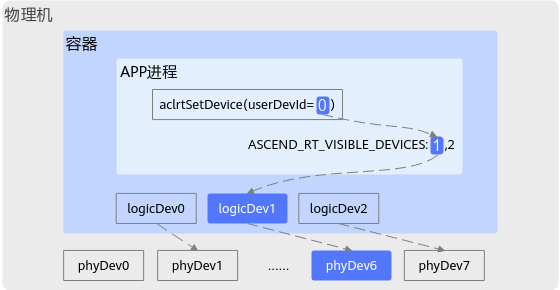

# aclrtGetLogicDevIdByUserDevId

## 产品支持情况


| 产品 | 是否支持 |
| --- | --- |
| Atlas A3 训练系列产品/Atlas A3 推理系列产品 | √ |
| Atlas A2 训练系列产品/Atlas A2 推理系列产品 | √ |

## 功能说明

根据用户设备ID获取对应的逻辑设备ID。

## 函数原型

```
aclError aclrtGetLogicDevIdByUserDevId(const int32_t userDevid, int32_t *const logicDevId)
```

## 参数说明


| 参数名 | 输入/输出 | 说明 |
| --- | --- | --- |
| userDevid | 输入 | 用户设备ID。 |
| logicDevId | 输出 | 逻辑设备ID。 |

## 返回值说明

返回0表示成功，返回其他值表示失败，请参见[aclError](aclError.md)。

## 用户设备ID、逻辑设备ID、物理设备ID之间的关系

若未设置ASCEND\_RT\_VISIBLE\_DEVICE环境变量，逻辑设备ID与用户设备ID相同；若在非容器场景下，物理设备ID与逻辑设备ID相同。

下图以容器场景且设置ASCEND\_RT\_VISIBLE\_DEVICE环境变量为例说明三者之间的关系：通过ASCEND\_RT\_VISIBLE\_DEVICES环境变量设置的Device ID依次为**1**、2，对应的Device索引值依次为**0**、1，通过[aclrtSetDevice](aclrtSetDevice.md)接口设置的用户设备ID为**0**，即对应的Device索引值为**0**，因此用户设备ID=**0**对应逻辑设备ID=**1**，容器中的逻辑设备ID=**1**又映射到物理设备ID=**6**，因此最终是使用ID为6的物理设备进行计算。



关于ASCEND\_RT\_VISIBLE\_DEVICES环境的详细介绍请参见《环境变量参考》。

