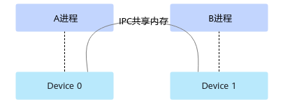

# aclrtIpcMemGetExportKey

## 产品支持情况


| 产品 | 是否支持 |
| --- | --- |
| Atlas A3 训练系列产品/Atlas A3 推理系列产品 | √ |
| Atlas A2 训练系列产品/Atlas A2 推理系列产品 | √ |

## 功能说明

在本进程中将指定Device内存设置为IPC（Inter-Process Communication）共享内存，并返回共享内存key，以便后续将内存共享给其它进程。

**本接口需与以下其它关键接口配合使用**，以便实现内存共享，此处以A、B进程为例，说明两个进程间的内存共享接口调用流程:

1.  在A进程中：
    1.  调用[aclrtMalloc](aclrtMalloc.md)接口申请内存。
    2.  调用[aclrtIpcMemGetExportKey](aclrtIpcMemGetExportKey.md)接口导出共享内存key。

        调用[aclrtIpcMemGetExportKey](aclrtIpcMemGetExportKey.md)接口时，可指定是否启用进程白名单校验，若启用，则需单独调用[aclrtIpcMemSetImportPid](aclrtIpcMemSetImportPid.md)接口将B进程的进程ID设置为白名单；反之，则无需调用[aclrtIpcMemSetImportPid](aclrtIpcMemSetImportPid.md)接口。

    3.  调用[aclrtIpcMemClose](aclrtIpcMemClose.md)接口关闭IPC共享内存。

        B进程调用[aclrtIpcMemClose](aclrtIpcMemClose.md)接口关闭IPC共享内存后，A进程再关闭IPC共享内存，否则可能导致异常。

    4.  调用[aclrtFree](aclrtFree.md)接口释放内存。

2.  在B进程中：
    1.  调用[aclrtDeviceGetBareTgid](aclrtDeviceGetBareTgid.md)接口，获取B进程的进程ID。

        本接口内部在获取进程ID时已适配物理机、虚拟机场景，用户只需调用本接口获取进程ID，再配合其它接口使用，达到内存共享的目的。若用户不调用本接口、自行获取进程ID，可能会导致后续使用进程ID异常。

    2.  调用[aclrtIpcMemImportByKey](aclrtIpcMemImportByKey.md)获取key的信息，并返回本进程可以使用的Device内存地址指针。

        调用[aclrtIpcMemImportByKey](aclrtIpcMemImportByKey.md)接口前，需确保待共享内存存在，不能提前释放。

    3.  调用[aclrtIpcMemClose](aclrtIpcMemClose.md)接口关闭IPC共享内存。

## 函数原型

```
aclError aclrtIpcMemGetExportKey(void *devPtr, size_t size, char *key, size_t len, uint64_t flags)
```

## 参数说明


| 参数名 | 输入/输出 | 说明 |
| --- | --- | --- |
| devPtr | 输入 | Device内存地址。 |
| size | 输入 | 内存大小，单位Byte。 |
| key | 输出 | 共享内存key。 |
| len | 输入 | key的长度，固定配置为65。 |
| flags | 输入 | 是否启用进程白名单校验。<br>取值为如下宏：<br><br>  - ACL_RT_IPC_MEM_EXPORT_FLAG_DEFAULT：默认值，启用进程白名单校验。配置为该值时，需单独调用[aclrtIpcMemSetImportPid](aclrtIpcMemSetImportPid.md)接口将使用共享内存key的进程ID设置为白名单。<br>  - ACL_RT_IPC_MEM_EXPORT_FLAG_DISABLE_PID_VALIDATION：关闭进程白名单校验。配置为该值时，则无需调用[aclrtIpcMemSetImportPid](aclrtIpcMemSetImportPid.md)接口。<br><br><br>宏的定义如下：<br>#define ACL_RT_IPC_MEM_EXPORT_FLAG_DEFAULT  0x0UL<br>#define ACL_RT_IPC_MEM_EXPORT_FLAG_DISABLE_PID_VALIDATION 0x1UL |

## 返回值说明

返回0表示成功，返回其他值表示失败，请参见[aclError](aclError.md)。

## 约束说明

不同Device上的两个进程通过IPC共享时，如下图，Device 0上的A进程通过IPC方式将内存共享给Device 1上的B进程，在B进程中使用此共享内存地址时：

-   内存复制时，不支持根据源内存地址指针、目的内存地址指针自动判断复制方向；不支持Host-\>Device或Device-\>Host方向的内存复制操作，同步复制、异步复制都不支持；不支持同一个Device内的同步内存复制，但支持同一个Device内的异步内存复制；
-   支持Cube计算单元、Vector计算单元跨片访问。



同一个Device上的两个进程通过IPC共享内存时，不存在以上约束。

