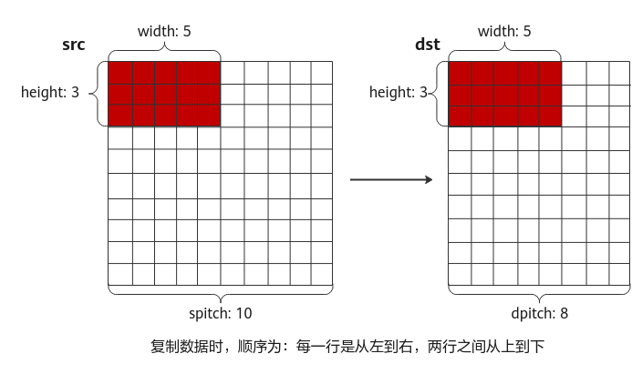

# aclrtMemcpy2dAsync

## 产品支持情况


| 产品 | 是否支持 |
| --- | --- |
| Atlas A3 训练系列产品/Atlas A3 推理系列产品 | √ |
| Atlas A2 训练系列产品/Atlas A2 推理系列产品 | √ |

## 功能说明

实现异步内存复制，主要用于矩阵数据的复制。异步接口。

本接口中的Host内存支持锁页内存（例如通过aclrtMallocHost接口申请的内存）、非锁页内存（通过malloc接口申请的内存）。当Host内存是非锁页内存时，本接口在内存复制任务完成后才返回；当Host内存是锁页内存时，本接口是异步接口，调用接口成功仅表示任务下发成功，不表示任务执行成功，调用本接口后，需调用同步等待接口（例如，[aclrtSynchronizeStream](aclrtSynchronizeStream.md)）确保内存复制的任务已执行完成。

## 函数原型

```
aclError aclrtMemcpy2dAsync(void *dst, size_t dpitch, const void *src, size_t spitch, size_t width, size_t height, aclrtMemcpyKind kind, aclrtStream stream)
```

## 参数说明


| 参数名 | 输入/输出 | 说明 |
| --- | --- | --- |
| dst | 输入 | 目的内存地址指针。 |
| dpitch | 输入 | 目的内存中相邻两列向量的地址距离。 |
| src | 输入 | 源内存地址指针。 |
| spitch | 输入 | 源内存中相邻两列向量的地址距离。 |
| width | 输入 | 待复制的数据宽度。 |
| height | 输入 | 待复制的数据高度。<br>height最大设置为5*1024*1024=5242880，否则接口返回失败。 |
| kind | 输入 | 内存复制的类型。 |
| stream | 输入 | 指定执行内存复制任务的Stream。 |

## 返回值说明

返回0表示成功，返回其他值表示失败，请参见[aclError](aclError.md)。

## 约束说明

本接口仅支持ACL\_MEMCPY\_HOST\_TO\_DEVICE、ACL\_MEMCPY\_DEVICE\_TO\_HOST、ACL\_MEMCPY\_DEVICE\_TO\_DEVICE内存复制类型。对于不支持的内存复制类型，接口返回ACL\_ERROR\_INVALID\_PARAM。

## 参考资源

本接口的内存复制示意图：



