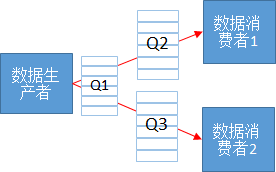

# acltdtBindQueueRoutes

## 产品支持情况


| 产品 | 是否支持 |
| --- | --- |
| Atlas A3 训练系列产品/Atlas A3 推理系列产品 | √ |
| Atlas A2 训练系列产品/Atlas A2 推理系列产品 | √ |

## 功能说明

当应用存在数据一对多分发时，通过本接口绑定队列间数据转发路由关系。

如下图所示，可以建立两条路由关系Q1-\>Q2，Q1-\>Q3。数据一对多分发时，传递的共享Buffer数据是无锁的，消费者不能对数据进行inplace操作，如下图所示消费者1对共享数据的修改会导致消费者2访问的数据发生变化。



## 函数原型

```
aclError acltdtBindQueueRoutes(acltdtQueueRouteList *qRouteList)
```

## 参数说明


| 参数名 | 输入/输出 | 说明 |
| --- | --- | --- |
| qRouteList | 输入/输出 | 路由关系数组的指针，接口调用完成后返回路由绑定结果。<br>需提前调用[acltdtCreateQueueRouteList](acltdtCreateQueueRouteList.md)接口创建acltdtQueueRouteList类型的数据，再调用[acltdtAddQueueRoute](acltdtAddQueueRoute.md)接口添加路由关系。 |

## 返回值说明

返回0表示成功，返回其他值表示失败，请参见[aclError](aclError.md)。

只有当所有队列关系绑定成功且路由状态正常时，本接口才会返回成功；任何一条绑定失败，本接口返回失败，如果您需要知道具体哪个路由关系绑定失败，您可以先调用[acltdtGetQueueRoute](acltdtGetQueueRoute.md)接口从路由关系数组中获取每一个路由关系，再调用[acltdtGetQueueRouteParam](acltdtGetQueueRouteParam.md)接口查询绑定关系状态。

## 约束说明

-   系统内部会对添加的队列路由关系的进行是否成环校验，不允许成环。
-   不支持多线程并发调用。

